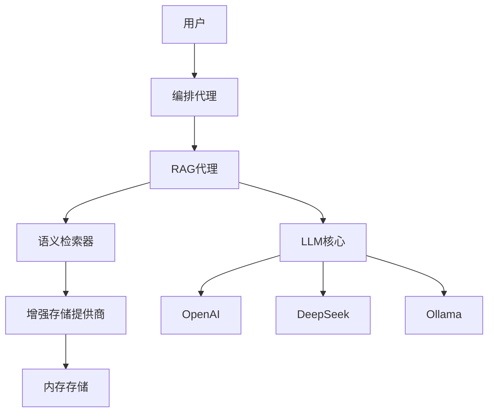

# 设计文档

## 概述

改进的RAG问答系统旨在解决当前系统的核心问题：从简单的信息检索转变为智能问答。系统将集成真正的LLM来基于检索到的上下文生成准确、针对性的答案，而不是返回原始的文档片段。

核心改进包括：
- 集成LLM进行答案生成
- 改进的语义检索能力
- 多语言支持（特别是中文）
- 智能回退机制
- 可配置的LLM提供商支持

## 架构

### 系统架构图



### 核心组件

1. **RAG代理 (RAGAgent)**: 主要的问答处理组件
2. **语义检索器 (SemanticRetriever)**: 基于向量相似度的智能检索
3. **增强存储提供商 (EnhancedStorageProvider)**: 支持语义搜索的存储层
4. **LLM核心 (LLMCore)**: 多提供商LLM集成层

## 组件和接口

### RAGAgent

**职责：**
- 接收用户问题
- 协调检索和答案生成过程
- 处理多语言问答
- 管理回退机制

**主要方法：**
```python
async def answer_question(self, question: str, language: str = "auto") -> Dict[str, Any]
async def _generate_answer_with_llm(self, question: str, context: List[Dict], language: str) -> str
async def _fallback_answer(self, question: str, retrieved_docs: List[Dict]) -> str
```

**接口规范：**
- 输入：用户问题字符串，可选语言参数
- 输出：包含答案、来源、置信度的结构化响应
- 错误处理：LLM不可用时的回退机制

### SemanticRetriever

**职责：**
- 将查询转换为向量表示
- 执行语义相似度搜索
- 根据相关性分数筛选结果

**主要方法：**
```python
def retrieve(self, query: str, top_k: int = 5, min_similarity: float = 0.3) -> List[Dict]
def _get_embedding(self, text: str) -> List[float]
def _calculate_similarity(self, query_embedding: List[float], doc_embedding: List[float]) -> float
```

**接口规范：**
- 输入：查询字符串，返回数量，最小相似度阈值
- 输出：按相关性排序的文档列表
- 性能要求：支持实时查询，响应时间 < 500ms

### EnhancedStorageProvider

**职责：**
- 扩展基础存储功能
- 集成语义检索能力
- 管理文档向量化

**主要方法：**
```python
def store_with_embedding(self, content: str, metadata: Dict) -> str
def semantic_search(self, query: str, top_k: int = 5) -> List[Dict]
def update_embeddings(self, doc_id: str, new_content: str) -> None
```

### LLM集成层

**职责：**
- 管理多个LLM提供商
- 实现自动故障转移
- 优化提示词模板

**支持的提供商：**
- OpenAI (GPT-3.5/4)
- DeepSeek
- Ollama (本地模型)

## 数据模型

### 问答请求模型
```python
@dataclass
class QuestionRequest:
    question: str
    language: Optional[str] = "auto"
    max_context_length: int = 2000
    min_confidence: float = 0.3
```

### 问答响应模型
```python
@dataclass
class QuestionResponse:
    answer: str
    confidence: float
    sources: List[Dict[str, Any]]
    language: str
    processing_time: float
    fallback_used: bool
```

### 文档模型
```python
@dataclass
class Document:
    id: str
    content: str
    embedding: List[float]
    metadata: Dict[str, Any]
    similarity_score: Optional[float] = None
```

## 错误处理

### 错误类型和处理策略

1. **LLM服务不可用**
   - 自动切换到备用LLM提供商
   - 如果所有LLM都不可用，使用基于检索的回退答案

2. **检索结果为空**
   - 返回友好的"无法找到相关信息"消息
   - 建议用户尝试不同的关键词

3. **检索结果相关性过低**
   - 明确标注答案的不确定性
   - 提供最相关的信息但警告可能不准确

4. **语言检测失败**
   - 默认使用中文处理
   - 记录语言检测失败的案例

### 错误响应格式
```python
@dataclass
class ErrorResponse:
    error_type: str
    message: str
    suggestions: List[str]
    fallback_available: bool
```

## 测试策略

### 单元测试
- **RAGAgent**: 测试问答逻辑、语言处理、回退机制
- **SemanticRetriever**: 测试向量检索、相似度计算
- **EnhancedStorageProvider**: 测试存储和检索功能
- **LLM集成**: 测试多提供商切换和错误处理

### 集成测试
- **端到端问答流程**: 从问题输入到答案输出的完整流程
- **多语言支持**: 中英文问答的准确性
- **故障转移**: LLM服务中断时的系统行为
- **性能测试**: 响应时间和并发处理能力

### 测试数据集
- **知识领域测试**: 涵盖技术、科学、常识等多个领域
- **数学问题测试**: 验证逻辑推理能力
- **中文问答测试**: 验证中文理解和生成能力
- **边界情况测试**: 空查询、超长查询、特殊字符等

## 性能考虑

### 响应时间优化
- **向量检索优化**: 使用高效的相似度计算算法
- **LLM调用优化**: 合理的超时设置和重试机制
- **缓存策略**: 缓存常见问题的答案和向量表示

### 内存管理
- **向量存储**: 使用内存高效的向量存储格式
- **文档缓存**: 限制内存中文档的数量
- **垃圾回收**: 定期清理不再使用的向量和缓存

### 可扩展性
- **水平扩展**: 支持多实例部署
- **存储扩展**: 支持外部向量数据库集成
- **负载均衡**: 在多个LLM提供商之间分配请求

## 配置管理

### LLM提供商配置
```yaml
llm_providers:
  primary: "openai"
  fallback: ["deepseek", "ollama"]
  openai:
    model: "gpt-3.5-turbo"
    api_key: "${OPENAI_API_KEY}"
    timeout: 30
  deepseek:
    model: "deepseek-chat"
    api_key: "${DEEPSEEK_API_KEY}"
    timeout: 30
  ollama:
    model: "llama2"
    base_url: "http://localhost:11434"
    timeout: 60
```

### 检索配置
```yaml
retrieval:
  top_k: 5
  min_similarity: 0.3
  max_context_length: 2000
  embedding_model: "simple"  # 或 "openai", "sentence-transformers"
```

### 语言配置
```yaml
language:
  default: "zh"
  supported: ["zh", "en"]
  auto_detect: true
  fallback_language: "zh"
```