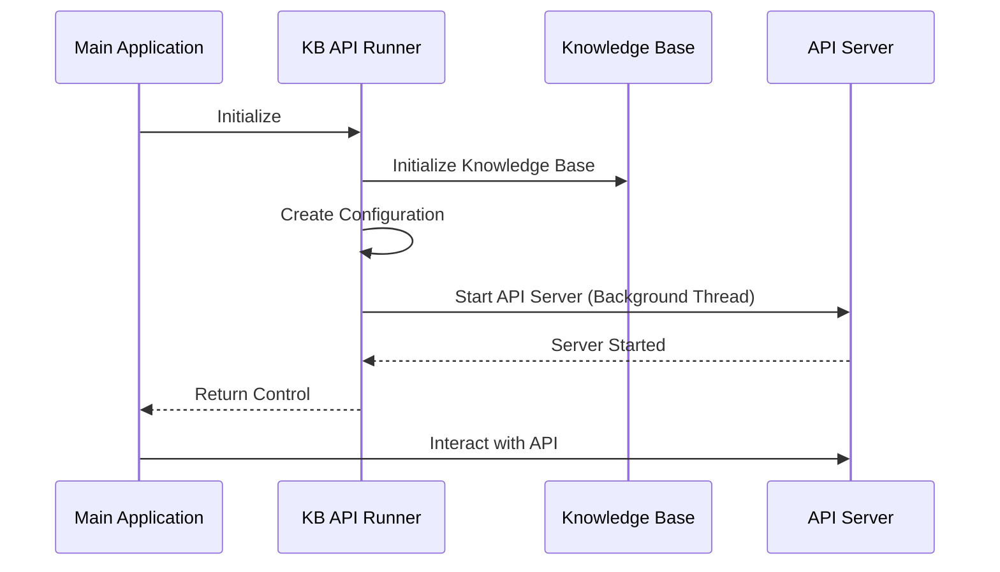

# Design Document: Knowledge Base API Runner

## Overview

The Knowledge Base API Runner is a component designed to initialize and run the knowledge base API server in a reliable and configurable way. It provides a simple interface for starting the knowledge base service with proper configuration and ensures the service is running correctly in the background. This component is essential for applications that need to interact with the knowledge base through its API.

## Architecture

The Knowledge Base API Runner follows a simple architecture:

1. **Initialization**: The component initializes the knowledge base with default settings.
2. **Configuration**: It creates a proper configuration for the API server.
3. **Server Startup**: It starts the API server in a background thread.
4. **Monitoring**: It provides feedback on the server status.

## Components and Interfaces

### Main Module (`run.py`)

The main module is responsible for initializing the knowledge base and starting the API server. It provides the following functionality:

- Import necessary modules and dependencies
- Initialize the knowledge base
- Create and configure the API server
- Start the API server in a background thread
- Provide feedback on the server status

### Knowledge Base Initialization

The knowledge base initialization function (`init_knowledge_base()`) is responsible for setting up the knowledge base with default settings. It should:

- Create a knowledge base instance
- Configure the knowledge base with default settings
- Return the initialized knowledge base instance

### API Server Runner

The API server runner function (`run_kb_api()`) is responsible for starting the API server with the provided configuration. It should:

- Create a FastAPI application using the knowledge base API server module
- Configure the application with the provided configuration
- Start the application using uvicorn
- Handle any errors that occur during startup

## Data Models

### Configuration

The configuration for the Knowledge Base API Runner is based on the `Config` class from the knowledge base core module. It includes the following key components:

- `api`: API server configuration
  - `host`: The host address to bind to
  - `port`: The port number to listen on
  - `docs_enabled`: Whether to enable API documentation
  - Other API-specific configuration options

### Thread Management

The Knowledge Base API Runner uses threading to run the API server in the background. The key components include:

- `threading.Thread`: Used to create a background thread for the API server
- `daemon` flag: Set to `True` to ensure the thread is terminated when the main application exits

## Error Handling

The Knowledge Base API Runner should handle errors gracefully and provide meaningful error messages. The error handling strategy includes:

1. **Import Errors**: Handle missing dependencies gracefully
2. **Initialization Errors**: Handle errors during knowledge base initialization
3. **Configuration Errors**: Handle invalid configuration values
4. **Server Startup Errors**: Handle errors during API server startup
5. **Thread Errors**: Handle errors in the background thread

## Testing Strategy

The testing strategy for the Knowledge Base API Runner includes:

1. **Unit Tests**:
   - Test knowledge base initialization
   - Test configuration creation
   - Test error handling

2. **Integration Tests**:
   - Test API server startup
   - Test API server configuration
   - Test API server accessibility

3. **End-to-End Tests**:
   - Test the complete workflow from initialization to API interaction
   - Test error scenarios
   - Test performance under load