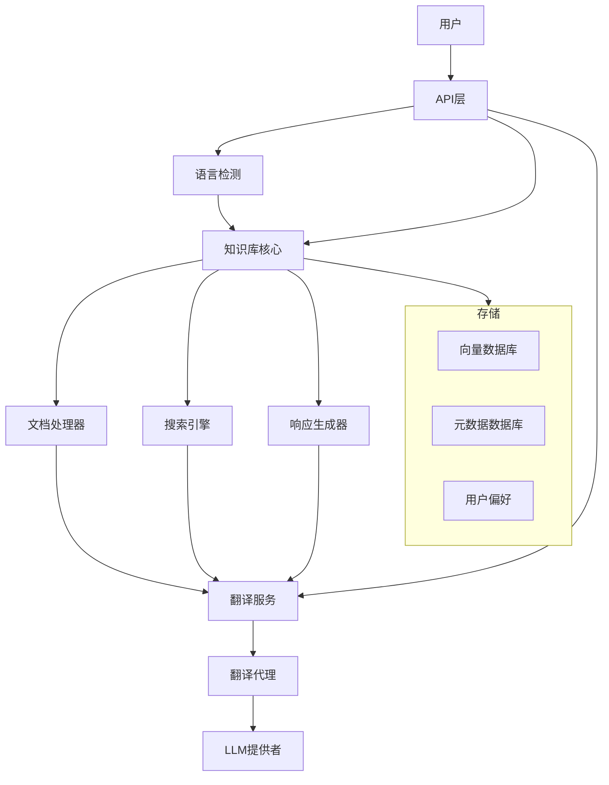

# 设计文档

## 概述

多语言知识库系统扩展了现有的知识库基础设施，以支持多种语言。本设计文档概述了实现多语言功能所需的架构、组件和接口，同时利用现有的翻译工具和知识库框架。

## 架构

多语言知识库系统将在现有架构的基础上，增加语言检测、翻译和多语言搜索的额外组件。高级架构如下图所示：



## 组件和接口

### 1. 语言检测组件

该组件将识别文档和查询的语言。

**接口：**
```python
class LanguageDetector:
    def detect_language(self, text: str) -> str:
        """
        检测提供文本的语言。
        
        参数：
            text: 要分析的文本
            
        返回：
            ISO语言代码（例如，'en'，'zh'，'es'）
        """
        pass
    
    def detect_language_confidence(self, text: str) -> dict:
        """
        检测语言并提供置信度分数。
        
        参数：
            text: 要分析的文本
            
        返回：
            将语言代码映射到置信度分数的字典
        """
        pass
```

### 2. 翻译服务

该组件将处理所有翻译操作，利用现有的TranslatorAgent。

**接口：**
```python
class TranslationService:
    def __init__(self, translator_agent: TranslatorAgent):
        self.translator = translator_agent
    
    async def translate_text(self, text: str, source_lang: str, target_lang: str) -> str:
        """
        将文本从源语言翻译成目标语言。
        
        参数：
            text: 要翻译的文本
            source_lang: 源语言代码
            target_lang: 目标语言代码
            
        返回：
            翻译后的文本
        """
        pass
    
    async def translate_batch(self, texts: List[str], source_lang: str, target_lang: str) -> List[str]:
        """
        批量翻译多个文本。
        
        参数：
            texts: 要翻译的文本列表
            source_lang: 源语言代码
            target_lang: 目标语言代码
            
        返回：
            翻译后的文本列表
        """
        pass
    
    def get_supported_languages(self) -> List[str]:
        """
        获取支持的语言代码列表。
        
        返回：
            支持的ISO语言代码列表
        """
        pass
```

### 3. 多语言文档处理器

该组件将扩展现有的文档处理器以处理多语言内容。

**接口：**
```python
class MultilingualDocumentProcessor:
    def __init__(self, language_detector: LanguageDetector, translation_service: TranslationService):
        self.language_detector = language_detector
        self.translation_service = translation_service
    
    async def process_document(self, content: str, metadata: dict = None) -> dict:
        """
        处理文档，检测语言并准备存储。
        
        参数：
            content: 文档内容
            metadata: 可选的元数据，包括已知的语言
            
        返回：
            带有语言元数据的处理后文档
        """
        pass
    
    async def extract_multilingual_chunks(self, document: dict) -> List[dict]:
        """
        从文档中提取具有语言感知的块。
        
        参数：
            document: 要处理的文档
            
        返回：
            带有语言元数据的块列表
        """
        pass
```

### 4. 多语言搜索引擎

该组件将扩展现有的搜索功能以跨语言工作。

**接口：**
```python
class MultilingualSearchEngine:
    def __init__(self, language_detector: LanguageDetector, translation_service: TranslationService):
        self.language_detector = language_detector
        self.translation_service = translation_service
    
    async def search(self, query: str, user_language: str = None, filters: dict = None) -> List[dict]:
        """
        执行多语言搜索。
        
        参数：
            query: 搜索查询
            user_language: 用户的首选语言
            filters: 可选的搜索过滤器
            
        返回：
            搜索结果列表
        """
        pass
    
    async def translate_results(self, results: List[dict], target_language: str) -> List[dict]:
        """
        将搜索结果翻译成目标语言。
        
        参数：
            results: 搜索结果
            target_language: 目标语言代码
            
        返回：
            翻译后的搜索结果
        """
        pass
```

### 5. 用户偏好管理器

该组件将管理用户语言偏好。

**接口：**
```python
class UserPreferencesManager:
    async def get_user_language(self, user_id: str) -> str:
        """
        获取用户的首选语言。
        
        参数：
            user_id: 用户标识符
            
        返回：
            用户的首选语言代码
        """
        pass
    
    async def set_user_language(self, user_id: str, language: str) -> None:
        """
        设置用户的首选语言。
        
        参数：
            user_id: 用户标识符
            language: 语言代码
        """
        pass
    
    async def get_user_translation_settings(self, user_id: str) -> dict:
        """
        获取用户的翻译设置。
        
        参数：
            user_id: 用户标识符
            
        返回：
            翻译设置字典
        """
        pass
```

### 6. 多语言响应生成器

该组件将以用户的首选语言生成响应。

**接口：**
```python
class MultilingualResponseGenerator:
    def __init__(self, translation_service: TranslationService):
        self.translation_service = translation_service
    
    async def generate_response(self, query: str, context: List[dict], user_language: str) -> str:
        """
        以用户语言生成响应。
        
        参数：
            query: 用户查询
            context: 上下文信息
            user_language: 用户的首选语言
            
        返回：
            以用户语言生成的响应
        """
        pass
    
    async def translate_conversation_history(self, history: List[dict], target_language: str) -> List[dict]:
        """
        将对话历史翻译成目标语言。
        
        参数：
            history: 对话历史
            target_language: 目标语言代码
            
        返回：
            翻译后的对话历史
        """
        pass
```

## 数据模型

### 文档模型

```python
class MultilingualDocument:
    id: str
    title: str
    content: str
    original_language: str
    available_translations: List[str]
    metadata: dict
    chunk_ids: List[str]
```

### 块模型

```python
class MultilingualChunk:
    chunk_id: str
    text: str
    original_language: str
    embedding: List[float]
    document_id: str
    metadata: dict
```

### 用户偏好模型

```python
class UserLanguagePreferences:
    user_id: str
    preferred_language: str
    auto_translate: bool
    preserve_terms: List[str]
    translation_quality_threshold: float
```

### 翻译缓存模型

```python
class TranslationCacheEntry:
    original_text_hash: str
    original_language: str
    target_language: str
    translated_text: str
    quality_score: float
    timestamp: datetime
```

## 错误处理

1. **语言检测失败**
   - 回退到英语或可配置的默认语言
   - 记录检测失败以供分析
   - 通知管理员重复失败

2. **翻译失败**
   - 返回原始文本并通知用户
   - 缓存经常失败的翻译以供手动审查
   - 实现带有指数退避的重试机制

3. **不支持的语言**
   - 向用户提供关于不支持语言的明确反馈
   - 基于语言家族提供替代语言
   - 允许管理员添加对新语言的支持

## 测试策略

1. **单元测试**
   - 测试各种语言和文本长度的语言检测准确性
   - 测试不同语言对的翻译质量
   - 测试错误处理和回退机制

2. **集成测试**
   - 测试端到端文档处理，包括语言检测和翻译
   - 测试跨多种语言的搜索功能
   - 测试带有语言切换的对话流程

3. **性能测试**
   - 测量不同文本大小的翻译延迟
   - 评估多语言查询的搜索性能
   - 测试并发多语言操作下的系统负载

4. **用户接受测试**
   - 与支持语言的母语使用者一起测试
   - 评估翻译质量和准确性
   - 评估切换语言时的用户体验

## 安全考虑

1. **数据隐私**
   - 确保翻译的安全处理
   - 为翻译内容实施适当的访问控制
   - 考虑不同语言的数据驻留要求

2. **输入验证**
   - 验证所有语言的输入以防止注入攻击
   - 实施适当的字符编码处理
   - 过滤掉恶意内容，无论语言如何

3. **第三方服务**
   - 审计翻译服务提供商的安全合规性
   - 为服务中断实施回退机制
   - 监控外部翻译服务的使用和成本

## 实施阶段

1. **阶段1：核心基础设施**
   - 实施语言检测
   - 与现有TranslatorAgent集成
   - 使用语言元数据扩展文档模型

2. **阶段2：文档处理**
   - 实施多语言文档处理
   - 添加语言感知分块
   - 开发翻译缓存机制

3. **阶段3：搜索和检索**
   - 实施跨语言搜索
   - 开发结果翻译功能
   - 添加语言过滤选项

4. **阶段4：用户体验**
   - 实施用户语言偏好
   - 在对话中添加语言切换
   - 开发翻译的UI指示器

5. **阶段5：优化和扩展**
   - 优化翻译性能
   - 实施批量翻译以提高效率
   - 添加翻译质量监控