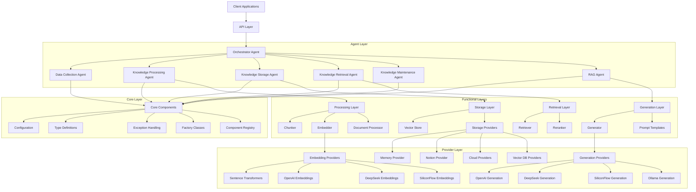
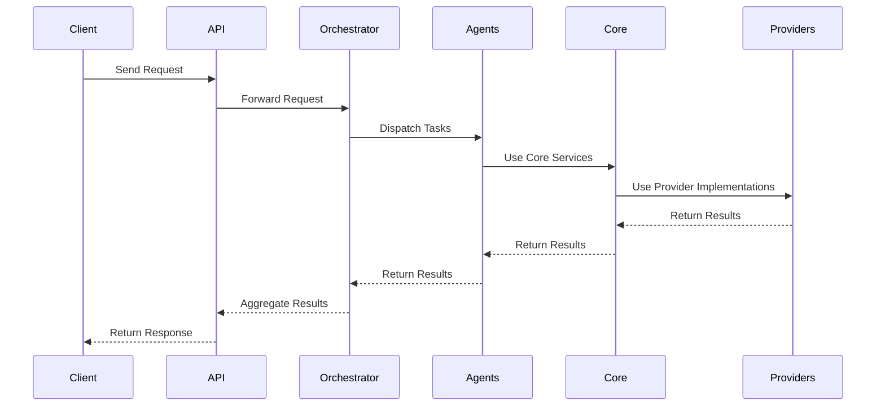

# Design Document: Unified Knowledge Base System

## Overview

The Unified Knowledge Base System is designed to integrate two existing knowledge base implementations into a single, cohesive platform. The design follows a hybrid architecture that combines the strengths of a layered approach with a multi-agent system. This document outlines the architectural decisions, component designs, interfaces, and data models that will form the foundation of the unified system.

## Architecture

### High-Level Architecture

The system follows a hybrid architecture with the following key characteristics:

1. **Layered Core**: A clear separation of concerns with distinct layers for core functionality, storage, processing, retrieval, and generation.
2. **Multi-Agent Coordination**: A flexible agent-based system where specialized agents collaborate to accomplish complex tasks.
3. **Provider Pattern**: Consistent interfaces for pluggable components like storage backends, embedding models, and generation models.
4. **Event-Driven Communication**: Asynchronous communication between components using events and messages.
5. **API-First Design**: RESTful and WebSocket APIs for external integration.

### Architecture Diagram



### Component Interactions

The system uses a combination of direct method calls and event-based communication:

1. **Direct Method Calls**: Used within layers for synchronous operations.
2. **Event-Based Communication**: Used between agents and for asynchronous operations.
3. **Message Passing**: Used for agent-to-agent communication.



## Components and Interfaces

### Core Module

The Core module provides fundamental services and interfaces used throughout the system.

#### Configuration System

The configuration system provides a unified way to configure all aspects of the system.

```python
class Config:
    """Unified configuration class for the knowledge base system."""
    
    def __init__(self, config_path: Optional[str] = None):
        """Initialize configuration from file or defaults."""
        self.system = SystemConfig()
        self.storage = StorageConfig()
        self.embedding = EmbeddingConfig()
        self.chunking = ChunkingConfig()
        self.retrieval = RetrievalConfig()
        self.generation = GenerationConfig()
        self.agents = AgentsConfig()
        self.api = APIConfig()
        
        if config_path:
            self.load_from_file(config_path)
        self.load_from_env()
    
    def load_from_file(self, path: str) -> None:
        """Load configuration from a file."""
        # Implementation details
        
    def load_from_env(self) -> None:
        """Load configuration from environment variables."""
        # Implementation details
        
    def validate(self) -> None:
        """Validate the configuration."""
        # Implementation details
```

#### Type Definitions

The type definitions provide a common set of data structures used throughout the system.

```python
class DocumentType(Enum):
    """Enumeration of document types."""
    TEXT = "text"
    PDF = "pdf"
    DOCX = "docx"
    MARKDOWN = "markdown"
    HTML = "html"
    IMAGE = "image"

@dataclass
class Document:
    """Represents a document in the knowledge base."""
    id: str
    content: str
    type: DocumentType
    metadata: Dict[str, Any] = field(default_factory=dict)
    
@dataclass
class TextChunk:
    """Represents a chunk of text extracted from a document."""
    id: str
    text: str
    document_id: str
    metadata: Dict[str, Any] = field(default_factory=dict)
    embedding: Optional[List[float]] = None
    
@dataclass
class QueryResult:
    """Represents the result of a query."""
    query: str
    answer: str
    chunks: List[TextChunk]
    metadata: Dict[str, Any] = field(default_factory=dict)
    
@dataclass
class AddResult:
    """Represents the result of adding a document."""
    document_id: str
    chunk_ids: List[str]
    success: bool
    error: Optional[str] = None
```

#### Exception Handling

A unified exception hierarchy for consistent error handling.

```python
class KnowledgeBaseError(Exception):
    """Base exception for all knowledge base errors."""
    pass

class ConfigurationError(KnowledgeBaseError):
    """Raised when there is a configuration error."""
    pass

class StorageError(KnowledgeBaseError):
    """Base exception for storage errors."""
    pass

class ProcessingError(KnowledgeBaseError):
    """Base exception for processing errors."""
    pass

class RetrievalError(KnowledgeBaseError):
    """Base exception for retrieval errors."""
    pass

class GenerationError(KnowledgeBaseError):
    """Base exception for generation errors."""
    pass

class AgentError(KnowledgeBaseError):
    """Base exception for agent errors."""
    pass
```

#### Factory and Registry

Factory classes and registries for creating and managing components.

```python
class Registry:
    """Registry for component implementations."""
    
    def __init__(self):
        self._components = {}
    
    def register(self, component_type: str, name: str, implementation: Any) -> None:
        """Register a component implementation."""
        if component_type not in self._components:
            self._components[component_type] = {}
        self._components[component_type][name] = implementation
    
    def get(self, component_type: str, name: str) -> Any:
        """Get a component implementation."""
        if component_type not in self._components or name not in self._components[component_type]:
            raise ValueError(f"No implementation found for {component_type}/{name}")
        return self._components[component_type][name]
    
    def list(self, component_type: str) -> List[str]:
        """List available implementations for a component type."""
        if component_type not in self._components:
            return []
        return list(self._components[component_type].keys())
```

### Storage Module

The Storage module provides interfaces and implementations for storing and retrieving documents and chunks.

#### Base Storage Interface

```python
class BaseVectorStore(ABC):
    """Base interface for vector stores."""
    
    @abstractmethod
    async def initialize(self) -> None:
        """Initialize the vector store."""
        pass
    
    @abstractmethod
    async def add_texts(
        self, 
        texts: List[str], 
        metadatas: Optional[List[Dict[str, Any]]] = None,
        ids: Optional[List[str]] = None,
        embeddings: Optional[List[List[float]]] = None
    ) -> List[str]:
        """Add texts to the vector store."""
        pass
    
    @abstractmethod
    async def similarity_search(
        self, 
        query: str, 
        k: int = 5, 
        filter: Optional[Dict[str, Any]] = None,
        embedding: Optional[List[float]] = None
    ) -> List[Tuple[TextChunk, float]]:
        """Search for similar texts."""
        pass
    
    @abstractmethod
    async def delete(self, ids: List[str]) -> None:
        """Delete texts from the vector store."""
        pass
    
    @abstractmethod
    async def clear(self) -> None:
        """Clear all texts from the vector store."""
        pass
```

#### Vector Store Factory

```python
class VectorStore:
    """Factory for creating vector stores."""
    
    @staticmethod
    def create(config: Config) -> BaseVectorStore:
        """Create a vector store based on configuration."""
        provider = config.storage.provider
        if provider == "memory":
            from .providers.memory import MemoryVectorStore
            return MemoryVectorStore(config)
        elif provider == "notion":
            from .providers.notion import NotionVectorStore
            return NotionVectorStore(config)
        elif provider == "chroma":
            from .providers.chroma import ChromaVectorStore
            return ChromaVectorStore(config)
        # Additional providers...
        else:
            raise ValueError(f"Unknown vector store provider: {provider}")
```

### Processing Module

The Processing module handles document processing, chunking, and embedding.

#### Document Processor

```python
class DocumentProcessor:
    """Processes documents into chunks."""
    
    def __init__(self, config: Config):
        self.config = config
        self.chunker = self._create_chunker()
        self.embedder = self._create_embedder()
    
    def _create_chunker(self) -> Chunker:
        """Create a chunker based on configuration."""
        strategy = self.config.chunking.strategy
        if strategy == "recursive":
            from .strategies.recursive import RecursiveChunker
            return RecursiveChunker(self.config)
        # Additional strategies...
        else:
            raise ValueError(f"Unknown chunking strategy: {strategy}")
    
    def _create_embedder(self) -> Embedder:
        """Create an embedder based on configuration."""
        provider = self.config.embedding.provider
        if provider == "sentence_transformers":
            from .providers.sentence_transformers import SentenceTransformersEmbedder
            return SentenceTransformersEmbedder(self.config)
        # Additional providers...
        else:
            raise ValueError(f"Unknown embedding provider: {provider}")
    
    async def process_document(self, document: Document) -> List[TextChunk]:
        """Process a document into chunks with embeddings."""
        chunks = self.chunker.chunk(document)
        await self.embedder.embed_chunks(chunks)
        return chunks
```

#### Chunker Interface

```python
class Chunker(ABC):
    """Base interface for text chunkers."""
    
    def __init__(self, config: Config):
        self.config = config
    
    @abstractmethod
    def chunk(self, document: Document) -> List[TextChunk]:
        """Chunk a document into text chunks."""
        pass
```

#### Embedder Interface

```python
class Embedder(ABC):
    """Base interface for text embedders."""
    
    def __init__(self, config: Config):
        self.config = config
    
    @abstractmethod
    async def embed_text(self, text: str) -> List[float]:
        """Embed a single text."""
        pass
    
    @abstractmethod
    async def embed_texts(self, texts: List[str]) -> List[List[float]]:
        """Embed multiple texts."""
        pass
    
    async def embed_chunks(self, chunks: List[TextChunk]) -> None:
        """Embed text chunks in-place."""
        texts = [chunk.text for chunk in chunks]
        embeddings = await self.embed_texts(texts)
        for chunk, embedding in zip(chunks, embeddings):
            chunk.embedding = embedding
```

### Retrieval Module

The Retrieval module handles searching and retrieving relevant information.

#### Retriever Interface

```python
class Retriever:
    """Retrieves relevant chunks for a query."""
    
    def __init__(self, config: Config, vector_store: BaseVectorStore):
        self.config = config
        self.vector_store = vector_store
        self.strategy = self._create_strategy()
        self.reranker = self._create_reranker()
    
    def _create_strategy(self) -> RetrievalStrategy:
        """Create a retrieval strategy based on configuration."""
        strategy = self.config.retrieval.strategy
        if strategy == "semantic":
            from .strategies.semantic import SemanticStrategy
            return SemanticStrategy(self.config)
        elif strategy == "keyword":
            from .strategies.keyword import KeywordStrategy
            return KeywordStrategy(self.config)
        elif strategy == "hybrid":
            from .strategies.hybrid import HybridStrategy
            return HybridStrategy(self.config)
        else:
            raise ValueError(f"Unknown retrieval strategy: {strategy}")
    
    def _create_reranker(self) -> Optional[Reranker]:
        """Create a reranker if enabled."""
        if not self.config.retrieval.reranking_enabled:
            return None
        return Reranker(self.config)
    
    async def retrieve(
        self, 
        query: str, 
        k: Optional[int] = None, 
        filter: Optional[Dict[str, Any]] = None
    ) -> List[TextChunk]:
        """Retrieve relevant chunks for a query."""
        k = k or self.config.retrieval.top_k
        results = await self.strategy.retrieve(self.vector_store, query, k, filter)
        
        if self.reranker:
            results = self.reranker.rerank(query, results)
        
        return [chunk for chunk, _ in results]
```

### Generation Module

The Generation module handles generating responses based on retrieved information.

#### Generator Interface

```python
class Generator:
    """Generates responses based on retrieved information."""
    
    def __init__(self, config: Config):
        self.config = config
        self.provider = self._create_provider()
    
    def _create_provider(self) -> GenerationProvider:
        """Create a generation provider based on configuration."""
        provider = self.config.generation.provider
        if provider == "openai":
            from .providers.openai import OpenAIProvider
            return OpenAIProvider(self.config)
        elif provider == "deepseek":
            from .providers.deepseek import DeepSeekProvider
            return DeepSeekProvider(self.config)
        # Additional providers...
        else:
            raise ValueError(f"Unknown generation provider: {provider}")
    
    async def generate(
        self, 
        query: str, 
        chunks: List[TextChunk],
        stream: Optional[bool] = None
    ) -> Union[str, AsyncIterator[str]]:
        """Generate a response based on a query and retrieved chunks."""
        prompt = self._create_prompt(query, chunks)
        stream = stream if stream is not None else self.config.generation.stream
        
        if stream:
            return await self.provider.generate_stream(prompt)
        else:
            return await self.provider.generate(prompt)
    
    def _create_prompt(self, query: str, chunks: List[TextChunk]) -> str:
        """Create a prompt for the generation model."""
        # Implementation details
```

### Agent Module

The Agent module provides the multi-agent architecture for coordinating complex tasks.

#### Base Agent Interface

```python
class BaseAgent(ABC):
    """Base interface for all agents."""
    
    def __init__(self, config: Config):
        self.config = config
    
    @abstractmethod
    async def process_message(self, message: AgentMessage) -> AgentMessage:
        """Process a message and return a response."""
        pass
```

#### Orchestrator Agent

```python
class OrchestratorAgent(BaseAgent):
    """Coordinates the workflow between agents."""
    
    def __init__(self, config: Config):
        super().__init__(config)
        self.agents = {}
        self._initialize_agents()
    
    def _initialize_agents(self) -> None:
        """Initialize all required agents."""
        self.agents["collection"] = DataCollectionAgent(self.config)
        self.agents["processing"] = KnowledgeProcessingAgent(self.config)
        self.agents["storage"] = KnowledgeStorageAgent(self.config)
        self.agents["retrieval"] = KnowledgeRetrievalAgent(self.config)
        self.agents["maintenance"] = KnowledgeMaintenanceAgent(self.config)
        self.agents["rag"] = RAGAgent(self.config)
    
    async def process_message(self, message: AgentMessage) -> AgentMessage:
        """Process a message by coordinating with other agents."""
        # Implementation details
    
    async def receive_request(
        self, 
        source: str, 
        request_type: str, 
        payload: Dict[str, Any]
    ) -> Dict[str, Any]:
        """Receive and process a request from an external source."""
        message = AgentMessage(
            source=source,
            destination="orchestrator",
            message_type=request_type,
            payload=payload
        )
        response = await self.process_message(message)
        return response.payload
```

### API Module

The API module provides external access to the knowledge base system.

#### API Server

```python
def create_app(config: Config) -> FastAPI:
    """Create a FastAPI application."""
    app = FastAPI(
        title="Knowledge Base API",
        description="API for the Unified Knowledge Base System",
        version="1.0.0"
    )
    
    # Initialize components
    orchestrator = OrchestratorAgent(config)
    
    # Register routes
    app.include_router(knowledge_router)
    app.include_router(query_router)
    app.include_router(admin_router)
    
    # Add middleware
    app.add_middleware(
        CORSMiddleware,
        allow_origins=config.api.cors_origins,
        allow_credentials=True,
        allow_methods=["*"],
        allow_headers=["*"],
    )
    
    # Dependency injection
    app.dependency_overrides[get_orchestrator] = lambda: orchestrator
    
    return app
```

## Data Models

### Core Data Models

The system uses the following core data models:

1. **Document**: Represents a document in the knowledge base.
2. **TextChunk**: Represents a chunk of text extracted from a document.
3. **QueryResult**: Represents the result of a query.
4. **AddResult**: Represents the result of adding a document.

### Agent Message Model

```python
@dataclass
class AgentMessage:
    """Message exchanged between agents."""
    source: str
    destination: str
    message_type: str
    payload: Dict[str, Any]
    id: str = field(default_factory=lambda: str(uuid.uuid4()))
    timestamp: float = field(default_factory=time.time)
    parent_id: Optional[str] = None
```

### API Models

```python
class DocumentModel(BaseModel):
    """API model for a document."""
    id: Optional[str] = None
    content: str
    type: str
    metadata: Dict[str, Any] = {}

class QueryModel(BaseModel):
    """API model for a query."""
    query: str
    filter: Optional[Dict[str, Any]] = None
    top_k: Optional[int] = None
    stream: Optional[bool] = None

class QueryResponseModel(BaseModel):
    """API model for a query response."""
    query: str
    answer: str
    chunks: List[Dict[str, Any]]
    metadata: Dict[str, Any] = {}
```

## Error Handling

### Exception Hierarchy

The system uses a hierarchical exception system to provide consistent error handling:

1. **KnowledgeBaseError**: Base exception for all knowledge base errors.
2. **ConfigurationError**: Raised when there is a configuration error.
3. **StorageError**: Base exception for storage errors.
4. **ProcessingError**: Base exception for processing errors.
5. **RetrievalError**: Base exception for retrieval errors.
6. **GenerationError**: Base exception for generation errors.
7. **AgentError**: Base exception for agent errors.

### Error Response Model

```python
class ErrorResponse(BaseModel):
    """API model for error responses."""
    error: str
    details: Optional[Dict[str, Any]] = None
    code: int = 500
```

### Error Handling Middleware

```python
@app.exception_handler(KnowledgeBaseError)
async def knowledge_base_exception_handler(request: Request, exc: KnowledgeBaseError):
    """Handle knowledge base exceptions."""
    if isinstance(exc, ConfigurationError):
        status_code = 400
    elif isinstance(exc, StorageError):
        status_code = 500
    # Additional error types...
    else:
        status_code = 500
    
    return JSONResponse(
        status_code=status_code,
        content={"error": str(exc), "code": status_code}
    )
```

## Testing Strategy

### Unit Testing

Unit tests will be written for all core components, focusing on:

1. **Core Module**: Configuration, types, exceptions, factory classes.
2. **Storage Module**: Base interfaces, provider implementations.
3. **Processing Module**: Chunking strategies, embedding providers.
4. **Retrieval Module**: Retrieval strategies, reranking.
5. **Generation Module**: Generation providers, prompt templates.
6. **Agent Module**: Agent implementations, message handling.

### Integration Testing

Integration tests will focus on:

1. **RAG Pipeline**: End-to-end testing of the retrieval-augmented generation pipeline.
2. **API Endpoints**: Testing all API endpoints with various inputs.
3. **Agent Coordination**: Testing the coordination between agents.
4. **Storage Providers**: Testing all storage provider implementations.

### End-to-End Testing

End-to-end tests will simulate real user scenarios:

1. **Complete Workflow**: Adding documents, querying, and generating responses.
2. **User Scenarios**: Testing common user workflows.
3. **Error Handling**: Testing system behavior under error conditions.

### Performance Testing

Performance tests will focus on:

1. **Load Testing**: Testing system behavior under load.
2. **Stress Testing**: Testing system behavior under extreme conditions.
3. **Scalability Testing**: Testing system scalability.

## Implementation Plan

The implementation will follow a phased approach:

### Phase 1: Core Infrastructure (Weeks 1-2)

1. Set up project structure
2. Implement core module (configuration, types, exceptions)
3. Implement basic factory classes and registries
4. Set up testing framework

### Phase 2: Storage and Processing (Weeks 3-4)

1. Implement storage interfaces and providers
2. Implement processing module (chunking, embedding)
3. Implement basic agent framework
4. Write tests for storage and processing

### Phase 3: Retrieval and Generation (Weeks 5-6)

1. Implement retrieval module (strategies, reranking)
2. Implement generation module (providers, prompts)
3. Implement RAG pipeline
4. Write tests for retrieval and generation

### Phase 4: Agents and API (Weeks 7-8)

1. Implement agent system (orchestrator, specialized agents)
2. Implement API layer (REST, WebSocket)
3. Implement authentication and authorization
4. Write tests for agents and API

### Phase 5: Documentation and Deployment (Weeks 9-10)

1. Write comprehensive documentation
2. Implement deployment configurations (Docker, Kubernetes)
3. Implement monitoring and logging
4. Perform final testing and optimization

## Conclusion

The Unified Knowledge Base System design provides a comprehensive framework for integrating the existing knowledge base systems into a cohesive platform. The hybrid architecture combines the strengths of a layered approach with a multi-agent system, providing both structure and flexibility. The modular design with clear interfaces ensures that components can be developed, tested, and replaced independently, while the provider pattern allows for easy extension with new implementations.

The implementation plan outlines a phased approach that will deliver value incrementally while managing project risks. Each phase builds on the previous one, ensuring that the system remains functional throughout the development process.

With this design, the Unified Knowledge Base System will provide a powerful platform for knowledge management, retrieval, and generation, meeting all the requirements outlined in the requirements document.