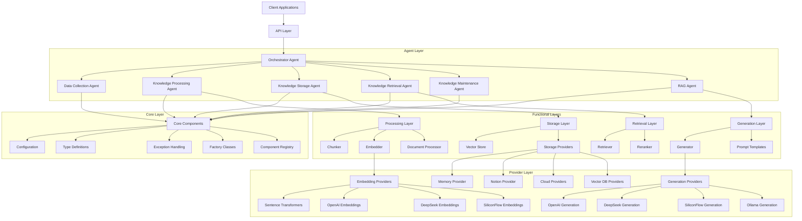
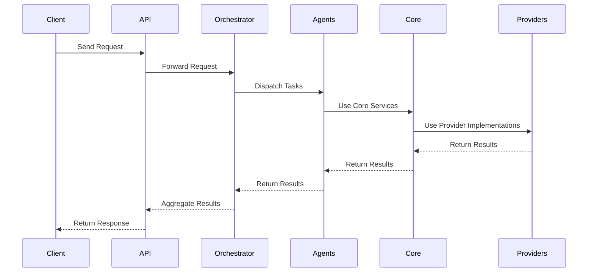
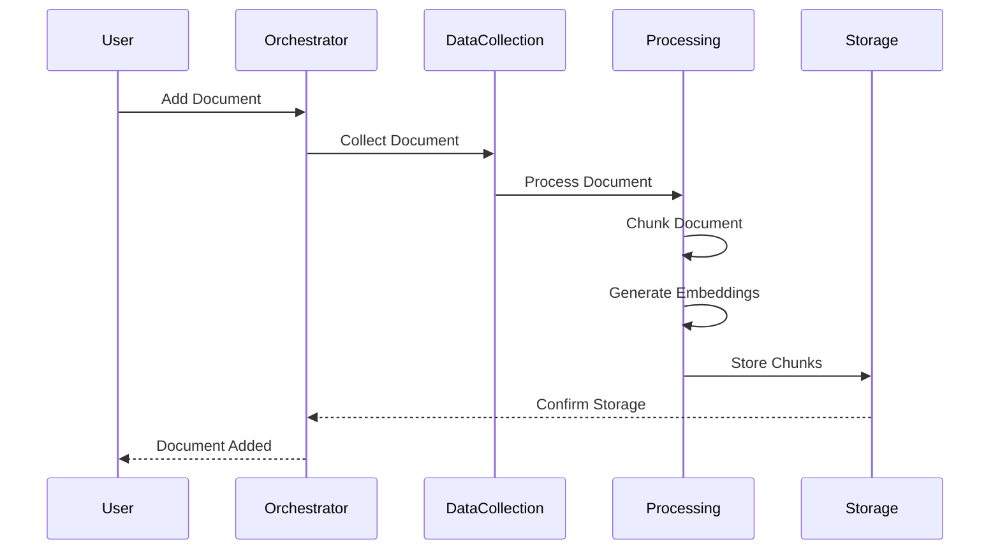
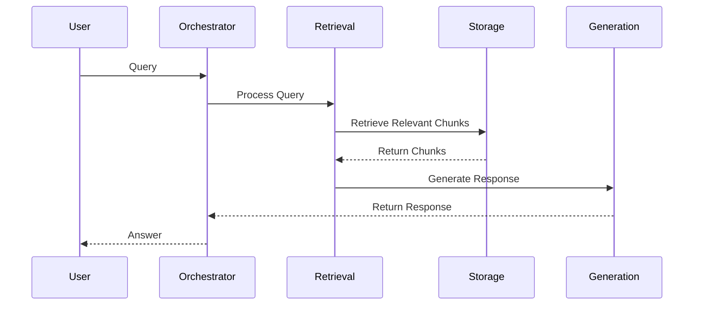
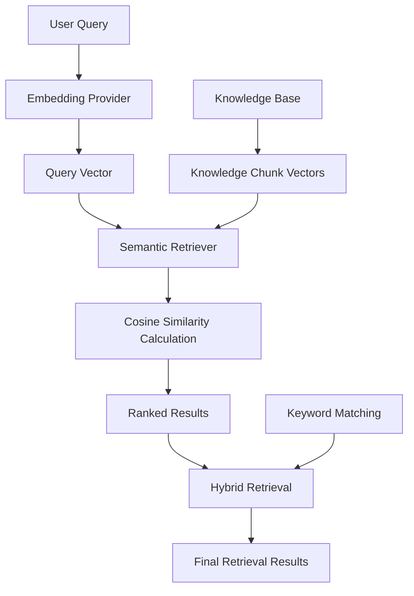
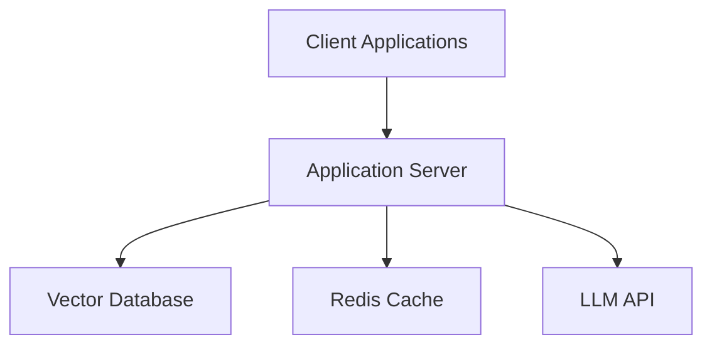
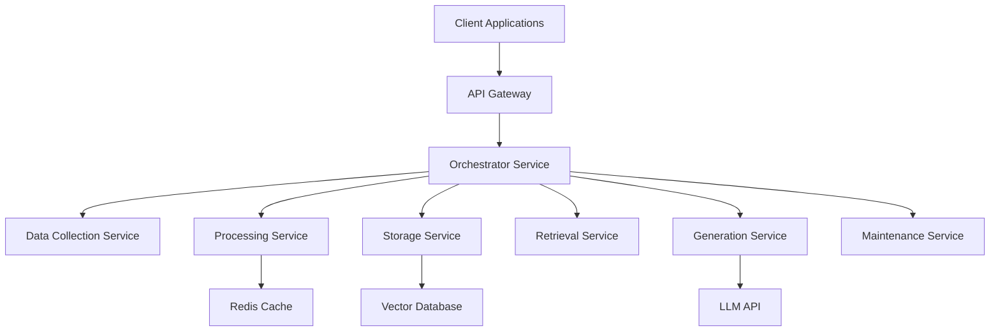

# Unified Knowledge Base System Architecture

## Overview

The Unified Knowledge Base System is a comprehensive platform that integrates multiple knowledge management capabilities into a single, cohesive system. It combines the strengths of a layered architecture with a multi-agent system to provide flexible, extensible, and efficient knowledge management.

The system is designed to handle various document formats, process them into meaningful chunks, store them efficiently, retrieve relevant information based on queries, and generate accurate responses using large language models (LLMs).

## Core Architecture

The system follows a hybrid architecture with the following key characteristics:

1. **Layered Core**: Clear separation of concerns with distinct layers for core functionality, storage, processing, retrieval, and generation.
2. **Multi-Agent Coordination**: Flexible agent-based system where specialized agents collaborate to accomplish complex tasks.
3. **Provider Pattern**: Consistent interfaces for pluggable components like storage backends, embedding models, and generation models.
4. **Event-Driven Communication**: Asynchronous communication between components using events and messages.
5. **API-First Design**: RESTful and WebSocket APIs for external integration.

## Architecture Diagram

## Component Interactions

The system uses a combination of direct method calls and event-based communication:

1. **Direct Method Calls**: Used within layers for synchronous operations.
2. **Event-Based Communication**: Used between agents and for asynchronous operations.
3. **Message Passing**: Used for agent-to-agent communication.

## Key Components

### Core Module

The Core module provides fundamental services and interfaces used throughout the system:

- **Configuration System**: Unified configuration for all system components
- **Type Definitions**: Common data structures used throughout the system
- **Exception Handling**: Unified exception hierarchy for consistent error handling
- **Factory and Registry**: Component creation and management

### Storage Module

The Storage module provides interfaces and implementations for storing and retrieving documents and chunks:

- **Base Storage Interface**: Common interface for all storage providers
- **Vector Store Factory**: Creates storage providers based on configuration
- **Storage Providers**: Implementations for various storage backends (Memory, Notion, Cloud, Vector DBs)

### Processing Module

The Processing module handles document processing, chunking, and embedding:

- **Document Processor**: Processes documents into chunks
- **Chunker Interface**: Splits documents into manageable chunks
- **Embedder Interface**: Converts text into vector representations
- **Metadata Extraction**: Extracts and manages document metadata

### Retrieval Module

The Retrieval module handles searching and retrieving relevant information:

- **Retriever Interface**: Retrieves relevant chunks for a query
- **Retrieval Strategies**: Different approaches to information retrieval (Semantic, Keyword, Hybrid)
- **Reranker**: Improves retrieval results through reranking
- **Context Manager**: Maintains context across queries

### Generation Module

The Generation module handles generating responses based on retrieved information:

- **Generator Interface**: Generates responses based on retrieved information
- **Generation Providers**: Implementations for various LLM providers
- **Prompt Templates**: Templates for consistent LLM prompts
- **Quality Control**: Ensures response quality

### Agent Module

The Agent module provides the multi-agent architecture for coordinating complex tasks:

- **Base Agent Interface**: Common interface for all agents
- **Orchestrator Agent**: Coordinates workflow between agents
- **Specialized Agents**: Agents for specific tasks (Data Collection, Processing, Storage, Retrieval, Maintenance)
- **Agent Communication**: Message passing between agents

### API Module

The API module provides external access to the knowledge base system:

- **RESTful API**: HTTP endpoints for system interaction
- **WebSocket API**: Real-time communication
- **Authentication and Authorization**: Security controls
- **Documentation**: API documentation and examples

## Data Flow

### Knowledge Addition Flow

### Query Flow

## Semantic Retrieval System

The system implements a true semantic understanding capability through its semantic retrieval system:

## LLM Integration

The system integrates with multiple LLM providers through a factory pattern:

- **OpenAI**: GPT-4o, GPT-4o-mini, GPT-3.5-turbo
- **DeepSeek**: DeepSeek-Chat models with Chinese optimization
- **Ollama**: Local models like Llama3.1

Features include:
- Asynchronous support
- Error handling and retry mechanisms
- Response caching
- Token counting
- Batch processing

## Deployment Architecture

The system can be deployed in various configurations:

### Single-Server Deployment

### Microservices Deployment

## Performance Considerations

- **Caching**: Embedding and response caching for improved performance
- **Batch Processing**: Batch operations for efficiency
- **Asynchronous Operations**: Non-blocking operations for better throughput
- **Connection Pooling**: Efficient database connections
- **Load Balancing**: Distribution of requests across multiple instances

## Security Architecture

- **Authentication**: API key and bearer token authentication
- **Authorization**: Role-based access control
- **Rate Limiting**: Protection against abuse
- **Input Validation**: Prevention of injection attacks
- **Secure Communication**: TLS encryption
- **Audit Logging**: Tracking of system access and changes

## Monitoring and Observability

- **Health Checks**: Regular system health monitoring
- **Performance Metrics**: Tracking of system performance
- **Logging**: Comprehensive logging for troubleshooting
- **Alerting**: Notification of system issues
- **Tracing**: Request tracing for performance analysis

## Conclusion

The Unified Knowledge Base System architecture provides a comprehensive framework for knowledge management, retrieval, and generation. Its modular design with clear interfaces ensures that components can be developed, tested, and replaced independently, while the provider pattern allows for easy extension with new implementations.

The hybrid architecture combines the strengths of a layered approach with a multi-agent system, providing both structure and flexibility. This design enables the system to handle complex knowledge management tasks efficiently and adapt to changing requirements.