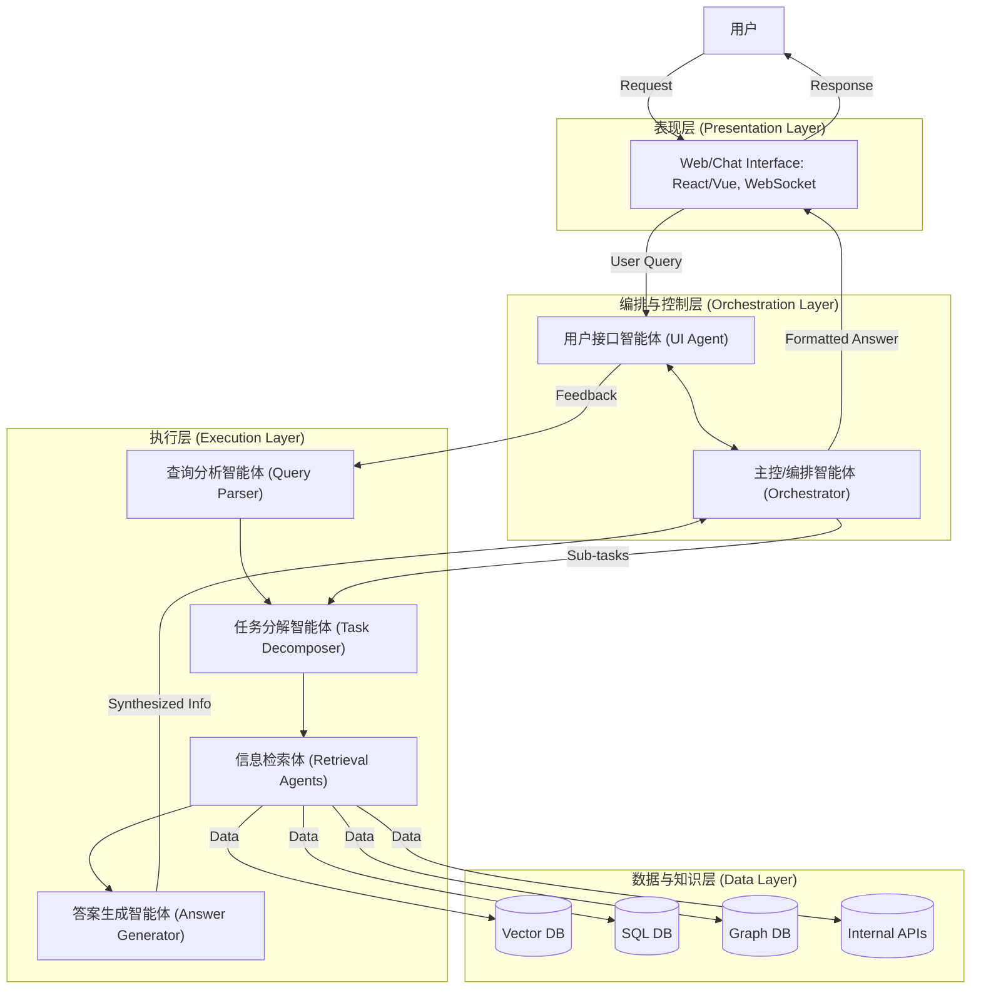
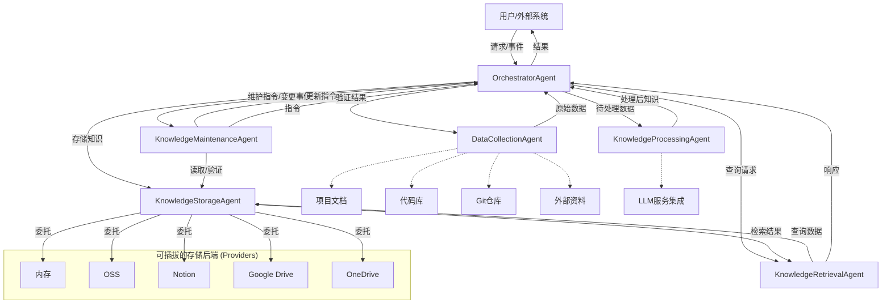
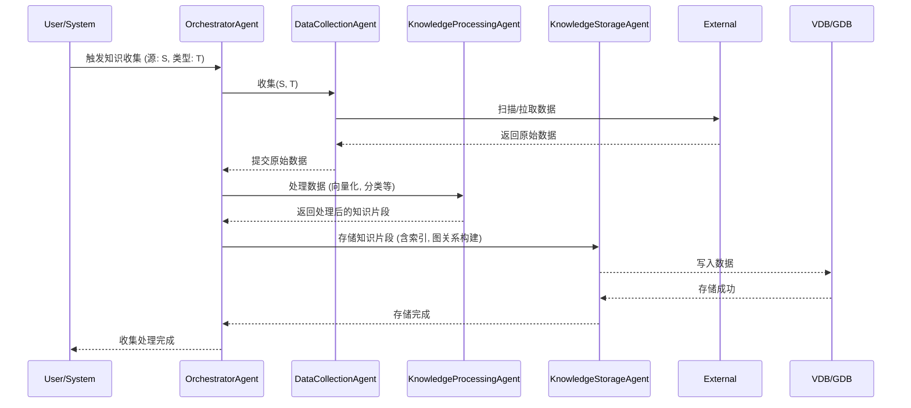
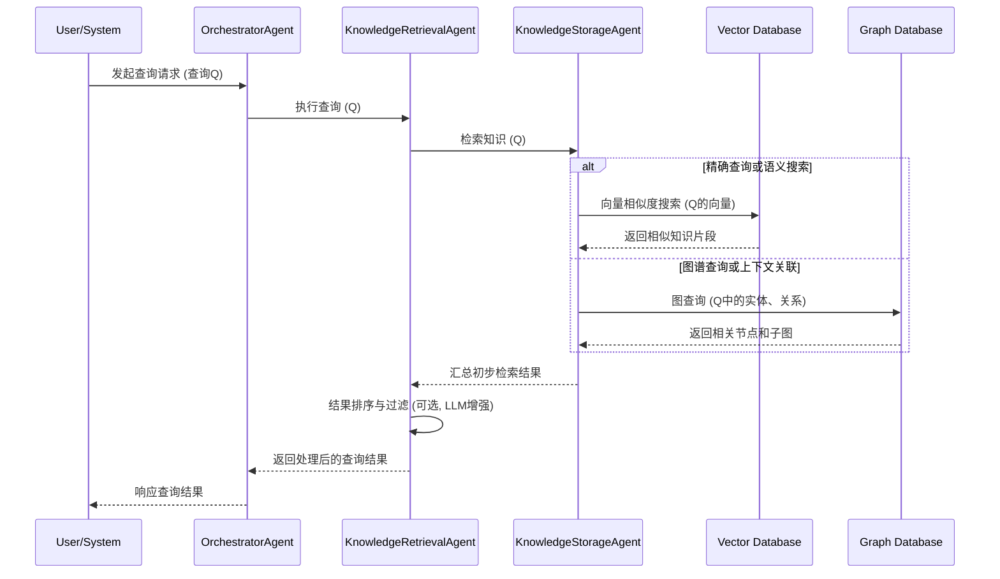
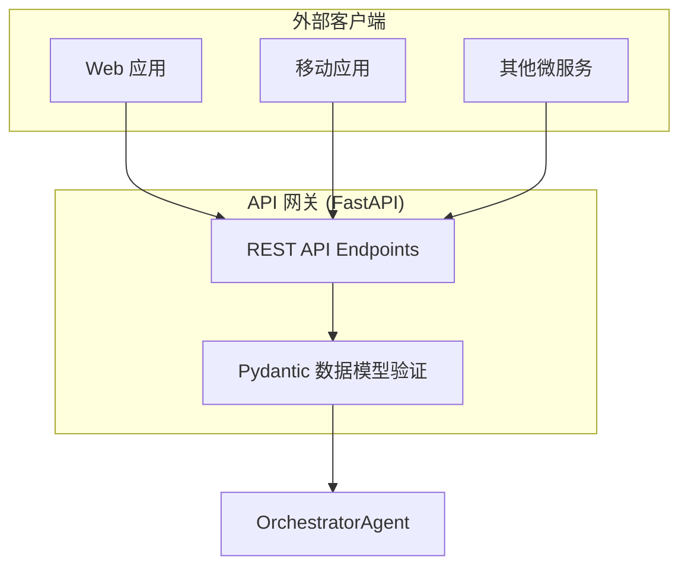

# 知识库多智能体系统统一设计文档

## 1. 概述

本设计文档将原有的单一知识库 Agent 方案扩展为一个多智能体协作系统。通过将不同职责分配给专门的智能体，我们可以实现更高效、灵活和可扩展的知识管理。该系统将包含负责知识收集、处理、存储、检索和维护等功能的独立智能体，并通过一个协调智能体进行统一调度和管理。

## 2. 智能体角色与职责

### 2.1 协调智能体 (OrchestratorAgent)

- **职责**：作为系统的入口和总指挥，负责接收用户请求或系统事件，将任务分发给相应的专业智能体，并汇总结果。在问答场景中，它负责实现 **检索增强生成 (RAG)** 的“生成”环节，将 `KnowledgeRetrievalAgent` 检索到的知识与用户问题结合，调用 LLM 生成最终答案。管理会话记忆，包括记忆的写入决策（如处理重复与溢出）。**在处理复杂请求时，能够运用高级推理策略（如 CoT, ReWOO, CoT-SC, ToT）进行任务规划、分解和动态调整，选择合适的智能体执行子任务。**

### 2.2 数据收集智能体 (DataCollectionAgent)

- **职责**：专门负责从各种来源收集原始知识数据，是系统数据导入功能的执行者。可根据不同数据源（如本地文件、网页、代码库、API 等）拥有不同的收集插件或微服务。支持常见的文档格式，例如 **PDF, TXT, Markdown**，并能通过 URL 抓取 **HTTP** 内容。

### 2.3 知识处理智能体 (KnowledgeProcessingAgent)

- **职责**：对收集到的原始数据进行清洗、预处理、向量化、分类等。准备好可供存储和索引的知识片段。

### 2.4 知识存储智能体 (KnowledgeStorageAgent)

- **职责**：作为知识存储策略的上下文（Context）。它不直接实现存储逻辑，而是根据配置，将所有存储和检索任务（`store`, `retrieve`）**委托**给一个具体的**存储提供者（Storage Provider）**。这种设计模式（策略模式）使得系统可以轻松地接入多种存储后端（如本地内存、OSS、Notion 等），而无需修改核心 Agent 逻辑。

### 2.5 知识检索智能体 (KnowledgeRetrievalAgent)

- **职责**：作为 **检索增强生成 (RAG)** 模式中的核心“检索”组件。根据用户查询，执行语义搜索、相似度匹配，并结合知识图谱进行上下文感知的问答。利用记忆读取机制（综合考量记忆的新近度、相关性和重要性）从会话历史或长期记忆中提取有价值信息，以增强查询理解和结果排序。**对于复杂查询，可采用多路径推理（如 CoT-SC）生成和评估多个候选答案路径，或使用类 ToT 的方法探索不同的信息组合与推理步骤。**

### 2.6 知识维护智能体 (KnowledgeMaintenanceAgent)

- **职责**：监控知识变更，执行自动更新、冲突检测与解决，以及知识有效性验证。

## 3. 系统架构

### 3.1 分层架构视图

系统采用分层架构，自上而下分为表现层、编排与控制层、执行层以及数据与知识层。这种设计模式确保了各层职责分明、高度解耦，从而提升了系统的可扩展性、可维护性和灵活性。



### 3.2 智能体交互视图

下图从智能体协作的视角，展示了各个智能体之间的具体交互流程和数据流向。



## 4. 工作流程

### 4.1 知识收集与处理流程



### 4.2 知识检索流程



## 5. 接口定义

### 5.1 OrchestratorAgent 接口

```python
def receive_request(source: str, request_type: str, payload: dict)
def distribute_task(agent_name: str, task_name: str, task_params: dict)
def aggregate_result(source_agent: str, status: str, result: dict)
```

### 5.2 DataCollectionAgent 接口

```python
def collect(source_config: dict) -> List[RawDocument]

# RawDocument 数据结构
{
    "id": str,
    "content": any,
    "source": str,
    "type": str,
    "metadata": dict
}
```

### 5.3 KnowledgeProcessingAgent 接口

```python
def process(documents: List[RawDocument]) -> List[ProcessedKnowledgeChunk]

# ProcessedKnowledgeChunk 数据结构
{
    "id": str,
    "original_id": str,
    "text_content": str,
    "vector": List[float],
    "category": str,
    "entities": List[str],
    "relationships": List[dict],
    "metadata": dict
}
```

### 5.4 KnowledgeStorageAgent 接口

```python
# 初始化时选择一个提供者
def __init__(self, provider_type: str, provider_config: dict)

# 所有操作都委托给内部提供者
def store(chunks: List[ProcessedKnowledgeChunk]) -> bool
def retrieve(query_vector: List[float], top_k: int, filters: dict) -> List[RetrievedChunk]
def get_all_chunk_ids() -> List[str]
```

#### 5.4.1 BaseStorageProvider 接口 (所有提供者都必须实现)

```python
def __init__(self, config: dict)
def store(chunks: List[ProcessedKnowledgeChunk]) -> bool
def retrieve(query_vector: List[float], top_k: int, filters: dict) -> List[RetrievedChunk]
def get_all_chunk_ids() -> List[str]
```

### 5.5 KnowledgeRetrievalAgent 接口

```python
def search(query: str, search_params: dict) -> List[AnswerCandidate]

# AnswerCandidate 数据结构
{
    "content": str,
    "source_id": str,
    "relevance_score": float,
    "context_snippets": List[str]
}
```

### 5.6 KnowledgeMaintenanceAgent 接口

```python
def check_updates(source_config: dict) -> List[ChangeEvent]
def validate_knowledge(knowledge_id: str) -> ValidationResult
def resolve_conflict(conflict_info: dict) -> Resolution
```

## 6. REST API 定义 (FastAPI)

为了将多智能体系统的能力暴露给外部客户端（如 Web 应用、移动端、桌面软件或其他微服务），我们将设计并实现一个 RESTful API。该 API 将使用 FastAPI 框架构建，利用其高性能、异步支持以及与 Pydantic 模型的无缝集成，可以自动生成交互式的 API 文档。

### 6.1 API 架构

API 层作为系统的统一入口，位于客户端和 `OrchestratorAgent` 之间。所有外部请求都由 API 服务器接收，经过验证和解析后，再调用 `OrchestratorAgent` 的相应功能来处理。



### 6.2 数据模型 (Pydantic)

我们将使用 Pydantic 来定义所有 API 请求和响应的数据结构，确保类型安全和数据验证。

```python
from pydantic import BaseModel, Field
from typing import List, Dict, Any, Literal, Optional
from uuid import UUID, uuid4

# --- 通用模型 ---
class Task(BaseModel):
    task_id: UUID = Field(default_factory=uuid4)
    status: Literal["pending", "running", "success", "failed"] = "pending"
    details: Optional[str] = None

# --- 知识库管理 ---
class KnowledgeSource(BaseModel):
    type: Literal["url", "file_path", "text"]
    location: str # URL, 本地文件路径或纯文本内容

class AddKnowledgeRequest(BaseModel):
    sources: List[KnowledgeSource]
    # 可选参数，用于指定处理方式等
    processing_options: Optional[Dict[str, Any]] = None

# --- 问答与聊天 ---
class ChatMessage(BaseModel):
    role: Literal["user", "assistant"]
    content: str

class QueryRequest(BaseModel):
    query: str
    session_id: Optional[str] = None # 用于保持对话历史
    history: List[ChatMessage] = Field(default_factory=list)
    # 高级参数，如指定推理策略
    search_params: Optional[Dict[str, Any]] = None

class RetrievedSource(BaseModel):
    source_id: str
    content: str
    relevance_score: float

class QueryResponse(BaseModel):
    answer: str
    session_id: str
    retrieved_sources: List[RetrievedSource]
```

### 6.3 API 端点 (Endpoints)

#### 6.3.1 知识库管理

-   **`POST /api/v1/knowledge`**: 添加新知识到知识库。
    -   **描述**: 接收一个或多个知识源（URL、文件等），启动一个异步的知识收集、处理和存储任务。
    -   **请求体**: `AddKnowledgeRequest`
    -   **成功响应 (202 Accepted)**: `Task` (包含 `task_id`，用于后续查询任务状态)

-   **`GET /api/v1/tasks/{task_id}`**: 查询异步任务的状态。
    -   **描述**: 根据任务 ID 获取知识添加任务的当前状态（如：处理中、已完成、失败）。
    -   **路径参数**: `task_id: UUID`
    -   **成功响应 (200 OK)**: `Task`

#### 6.3.2 问答

-   **`POST /api/v1/chat/query`**: 提出问题并获取答案 (RAG)。
    -   **描述**: 系统的核心端点，接收用户问题，执行完整的 RAG 流程（检索、增强、生成）并返回答案。
    -   **请求体**: `QueryRequest`
    -   **成功响应 (200 OK)**: `QueryResponse`

### 6.4 认证与安全

-   **API 密钥**: 所有 API 请求都需要在请求头中包含一个有效的 API 密钥 (`Authorization: Bearer <YOUR_API_KEY>`)。
-   **输入验证**: FastAPI 和 Pydantic 会自动处理大部分输入验证。
-   **CORS**: 配置跨域资源共享 (CORS) 中间件。

## 7. 未来展望

### 7.1 更智能的协调

- 引入更高级的计划和推理能力到 OrchestratorAgent:
  - **支持单路径推理（如 CoT, ReWOO）**
  - **支持多路径推理（如 CoT-SC, ToT）**
- 实现基于学习的路由策略
- 动态调整工作流程和智能体组合
- 增强 OrchestratorAgent 对记忆写入的智能决策能力

### 7.2 智能体能力增强

- **DataCollectionAgent**: 支持更多数据源、流式数据处理、实时音视频处理。
- **KnowledgeProcessingAgent**: 集成更先进的 NLP 模型、深层次理解和摘要生成、关系抽取和知识推理。
- **KnowledgeRetrievalAgent**: 多模态检索、对话式问答、上下文保持、更精细化的记忆读取评分函数。
- **KnowledgeMaintenanceAgent**: 主动知识发现、知识进化机制、过时知识识别、引入记忆反思机制。

### 7.3 人机协同与交互

- 用户友好的管理界面
- 人在回路 (Human-in-the-loop) 机制
- 专家参与知识验证

### 7.4 系统可扩展性与鲁棒性

- 优化通信效率
- 并发处理能力
- 错误处理机制
- 微服务部署
- 优化记忆存储和读取的性能

### 7.5 安全性与权限控制

- 细粒度访问控制
- 数据加密
- 隐私保护
- 审计日志

### 7.6 高级记忆管理

- **记忆读取优化**: 实现更先进的评分函数。
- **记忆写入策略**: 智能处理记忆重复与溢出。
- **记忆反思机制**: 实现多层次、多样化的反思过程。
- **记忆结构与组织**: 探索更复杂的记忆结构。

### 7.7 高级推理策略集成

- **单路径与多路径推理策略应用**: 在各智能体中应用 CoT, ReWOO, CoT-SC, ToT 等策略。
- **推理与记忆的协同**: 实现推理辅助记忆反思和记忆指导推理路径选择。

## 8. 评估与基准测试 (Evaluation & Benchmarking)

### 8.1 核心评估指标

- **RAG 管道评估**: 忠实度, 答案相关性, 上下文精确率, 上下文召回率, 答案语义相似度, 答案正确性。
- **系统性能指标**: 端到端延迟, 吞吐量, 成本。

### 8.2 评估数据集

- 构建标准问答集、合成数据集、真实用户查询日志。

### 8.3 特定智能体的评估方法

- **DataCollectionAgent**: 覆盖率, 准确性, 格式兼容性。
- **KnowledgeProcessingAgent**: 信息保留度, 向量化质量, 实体/关系抽取准确率。
- **KnowledgeRetrievalAgent**: 检索相关性 (MRR, nDCG)。
- **OrchestratorAgent**: 任务成功率, 规划效率, 工具/智能体选择准确率。

### 8.4 评估工作流

- 建立基准测试环境、自动化评估流水线、结果可视化与报告、A/B 测试。

## 9. 结语

通过持续迭代和演进，该多智能体知识库系统有望成为企业和组织内强大的知识赋能平台。系统的模块化设计和智能体协作机制，结合先进的记忆管理与反思能力，为未来的扩展和优化提供了坚实的基础。