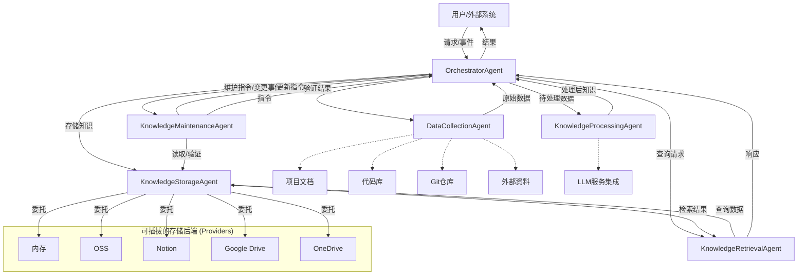
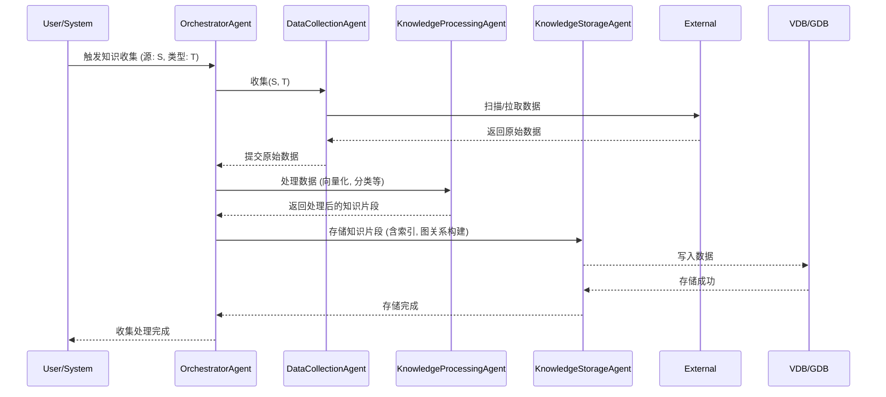
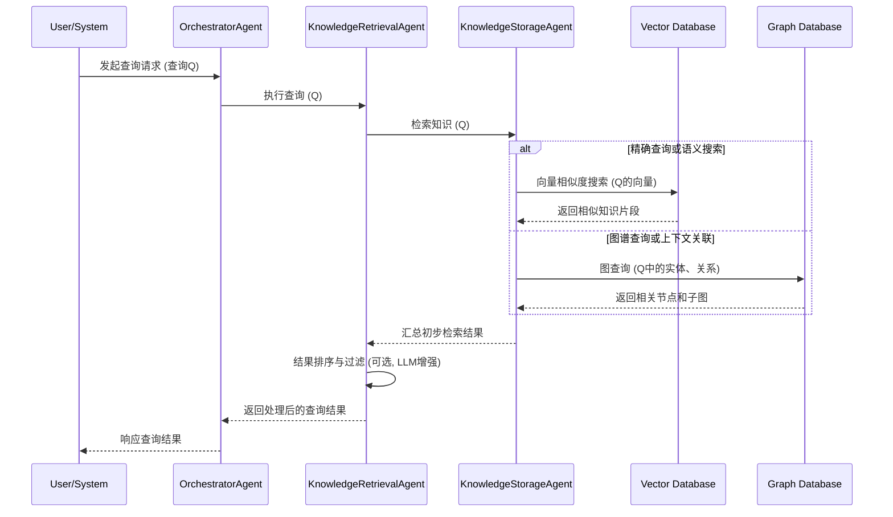

# 知识库多智能体系统设计文档

## 1. 概述

本设计文档将原有的单一知识库 Agent 方案扩展为一个多智能体协作系统。通过将不同职责分配给专门的智能体，我们可以实现更高效、灵活和可扩展的知识管理。该系统将包含负责知识收集、处理、存储、检索和维护等功能的独立智能体，并通过一个协调智能体进行统一调度和管理。

## 2. 智能体角色与职责

### 2.1 协调智能体 (OrchestratorAgent)

- **职责**：作为系统的入口和总指挥，负责接收用户请求或系统事件，将任务分发给相应的专业智能体，并汇总结果。管理智能体之间的通信和工作流程。管理会话记忆，包括记忆的写入决策（如处理重复与溢出）。**在处理复杂请求时，能够运用高级推理策略（如 CoT, ReWOO, CoT-SC, ToT）进行任务规划、分解和动态调整，选择合适的智能体执行子任务。**
- **对应原设计**：隐含的控制逻辑，KnowledgeAgent 主类的部分调度功能。

### 2.2 数据收集智能体 (DataCollectionAgent)

- **职责**：专门负责从各种来源收集原始知识数据。
- **对应原设计**：2.1 知识收集中的所有功能，collectors/ 目录下的相关收集器。
- **子模块/工具**：可根据不同数据源（文档、代码、Git、外部 API）拥有不同的收集插件或微服务。

### 2.3 知识处理智能体 (KnowledgeProcessingAgent)

- **职责**：对收集到的原始数据进行清洗、预处理、向量化、分类等。准备好可供存储和索引的知识片段。
- **对应原设计**：2.2 知识组织中的向量化、分类功能，processors/ 目录下的相关处理器。

### 2.4 知识存储智能体 (KnowledgeStorageAgent)

- **职责**：作为知识存储策略的上下文（Context）。它不直接实现存储逻辑，而是根据配置，将所有存储和检索任务（`store`, `retrieve`）**委托**给一个具体的**存储提供者（Storage Provider）**。这种设计模式（策略模式）使得系统可以轻松地接入多种存储后端（如本地内存、OSS、Notion 等），而无需修改核心 Agent 逻辑。
- **对应原设计**：解耦了原有的存储实现，将其抽象为可插拔的提供者。

### 2.5 知识检索智能体 (KnowledgeRetrievalAgent)

- **职责**：根据用户查询，执行语义搜索、相似度匹配，并结合知识图谱进行上下文感知的问答。利用记忆读取机制（综合考量记忆的新近度、相关性和重要性）从会话历史或长期记忆中提取有价值信息，以增强查询理解和结果排序。**对于复杂查询，可采用多路径推理（如 CoT-SC）生成和评估多个候选答案路径，或使用类 ToT 的方法探索不同的信息组合与推理步骤。**
- **对应原设计**：2.3 知识检索中的所有功能，tools/ 目录下的搜索相关工具。

### 2.6 知识维护智能体 (KnowledgeMaintenanceAgent)

- **职责**：监控知识变更，执行自动更新、冲突检测与解决，以及知识有效性验证。
- **对应原设计**：2.4 知识更新中的所有功能，processors/validator.py, tools/update.py。

## 3. 系统架构

### 3.1 系统架构图



## 4. 工作流程

### 4.1 知识收集与处理流程



### 4.2 知识检索流程



## 5. 接口定义

### 5.1 OrchestratorAgent 接口

```python
def receive_request(source: str, request_type: str, payload: dict)
def distribute_task(agent_name: str, task_name: str, task_params: dict)
def aggregate_result(source_agent: str, status: str, result: dict)
```

### 5.2 DataCollectionAgent 接口

```python
def collect(source_config: dict) -> List[RawDocument]

# RawDocument 数据结构
{
    "id": str,
    "content": any,
    "source": str,
    "type": str,
    "metadata": dict
}
```

### 5.3 KnowledgeProcessingAgent 接口

```python
def process(documents: List[RawDocument]) -> List[ProcessedKnowledgeChunk]

# ProcessedKnowledgeChunk 数据结构
{
    "id": str,
    "original_id": str,
    "text_content": str,
    "vector": List[float],
    "category": str,
    "entities": List[str],
    "relationships": List[dict],
    "metadata": dict
}
```

### 5.4 KnowledgeStorageAgent 接口

```python
# 初始化时选择一个提供者
def __init__(self, provider_type: str, provider_config: dict)

# 所有操作都委托给内部提供者
def store(chunks: List[ProcessedKnowledgeChunk]) -> bool
def retrieve(query_vector: List[float], top_k: int, filters: dict) -> List[RetrievedChunk]
def get_all_chunk_ids() -> List[str]
```

#### 5.4.1 BaseStorageProvider 接口 (所有提供者都必须实现)

```python
def __init__(self, config: dict)
def store(chunks: List[ProcessedKnowledgeChunk]) -> bool
def retrieve(query_vector: List[float], top_k: int, filters: dict) -> List[RetrievedChunk]
def get_all_chunk_ids() -> List[str]
```

### 5.5 KnowledgeRetrievalAgent 接口

```python
def search(query: str, search_params: dict) -> List[AnswerCandidate]

# AnswerCandidate 数据结构
{
    "content": str,
    "source_id": str,
    "relevance_score": float,
    "context_snippets": List[str]
}
```

### 5.6 KnowledgeMaintenanceAgent 接口

```python
def check_updates(source_config: dict) -> List[ChangeEvent]
def validate_knowledge(knowledge_id: str) -> ValidationResult
def resolve_conflict(conflict_info: dict) -> Resolution
```

## 6. 未来展望

### 6.1 更智能的协调

- 引入更高级的计划和推理能力到 OrchestratorAgent:
  - **支持单路径推理（如 CoT, ReWOO）**：对于需要逐步推理或在步骤间调用工具/其他 LLM 进行决策的任务规划。
  - **支持多路径推理（如 CoT-SC, ToT）**：允许 OrchestratorAgent 生成和评估多个任务计划或解决方案路径，选择最优方案执行，从而提高复杂决策的鲁棒性和质量。
- 实现基于学习的路由策略
- 动态调整工作流程和智能体组合
- 增强 OrchestratorAgent 对记忆写入的智能决策能力，例如基于上下文和记忆内容自动选择合并或覆盖策略。

### 6.2 智能体能力增强

- **DataCollectionAgent**

  - 支持更多类型的数据源
  - 流式数据处理
  - 实时音视频处理

- **KnowledgeProcessingAgent**

  - 集成更先进的 NLP 模型
  - 深层次理解和摘要生成
  - 关系抽取和知识推理
  - **在处理复杂的知识抽取或转换任务时，可以引入高级推理策略（如 CoT, ToT）以提高准确性和深度。**

- **KnowledgeRetrievalAgent**

  - 多模态检索能力
  - 对话式问答
  - 上下文保持能力
  - 实现更精细化的记忆读取评分函数，允许动态调整新近度、相关性和重要性的权重。
  - **深化高级推理在问答中的应用**：例如，使用 CoT-SC 生成多个答案候选，并根据置信度或证据进行选择；使用 ToT 方法探索不同知识片段的组合和推理链，以回答复杂问题。

- **KnowledgeMaintenanceAgent**

  - 主动知识发现
  - 知识进化机制
  - 过时知识识别
  - 引入记忆反思机制，定期或在特定触发条件下（如任务完成、遇到重复失败等）对存储的记忆进行总结、推理和抽象，形成更高阶的知识或行动策略。

### 6.3 人机协同与交互

- 用户友好的管理界面
- 人在回路 (Human-in-the-loop) 机制
- 专家参与知识验证

### 6.4 系统可扩展性与鲁棒性

- 优化通信效率
- 并发处理能力
- 错误处理机制
- 微服务部署
- 优化记忆存储和读取的性能，确保在记忆规模增大时系统仍能高效运作。

### 6.5 安全性与权限控制

- 细粒度访问控制
- 数据加密
- 隐私保护
- 审计日志

### 6.6 高级记忆管理 (新增章节)

- **记忆读取优化**:
  - 研究和实现更先进的评分函数，例如基于注意力机制的相关性计算。
  - 探索不同任务场景下 \(w_r, w_s, w_i\) 参数的最佳配置策略。
- **记忆写入策略**:
  - **记忆重复处理**：开发智能算法识别新增信息与现有记忆的相似度，并根据预设阈值或上下文决定是覆盖、合并（例如，使用 LLM 将多个相似行动序列压缩为统一计划）还是作为新记忆存储。
  - **记忆溢出管理**：除了先进先出（FIFO），研究和实现基于记忆重要性评分、使用频率或与当前任务相关性的淘汰策略。允许用户通过指令显式删除特定记忆。
- **记忆反思机制**:
  - **分层反思**：实现多层次的反思过程，允许智能体基于初步见解生成更深层次的抽象和总结。
  - **多样化反思触发器与方法**：
    - **基于事件触发**：如任务成功/失败后，自动触发对相关行动轨迹的反思。
    - **定期反思**：周期性地回顾和总结近期记忆。
    - **问题驱动反思**：如 Generative Agents 中，智能体根据近期记忆生成关键问题，并基于此进行信息检索和洞察生成。
    - **模式总结**：如 GITM 中，从一系列成功的子目标完成行动中总结通用模式。
    - **对比学习反思**：如 ExpeL 中，通过比较成功与失败的轨迹来提炼经验。
- **记忆结构与组织**:
  - 探索更复杂的记忆结构，如情景记忆、语义记忆、程序性记忆的分离与关联。
  - 研究如何将反思产生的抽象知识有效地组织并整合回现有记忆网络中。

### 6.7 高级推理策略集成 (新增章节)

- **单路径推理策略应用**:
  - **CoT (Chain-of-Thought)**: 在各智能体（尤其是 OrchestratorAgent, KnowledgeRetrievalAgent, KnowledgeProcessingAgent）执行需要多步逻辑的任务时，显式生成并记录推理链，以提高透明度和可调试性。
  - **ReWOO / HuggingGPT 模式**: OrchestratorAgent 在规划任务时，或 KnowledgeRetrievalAgent/KnowledgeProcessingAgent 在执行复杂子任务时，可以在推理步骤之间插入对其他专业智能体、特定 LLM 功能或外部工具的调用，形成"思考-行动-观察"的循环。
- **多路径推理策略应用**:
  - **CoT-SC (Chain-of-Thought Self-Consistency)**: 对于关键决策或复杂查询，智能体可以生成多个独立的推理链，并通过投票或其他集成方法选择最可靠的结果，提升鲁棒性。例如，KnowledgeRetrievalAgent 可以用此方法生成多个答案解释并进行择优。
  - **ToT (Tree of Thoughts) / RAP (Reasoning via Planning)**:
    - **OrchestratorAgent**: 在进行复杂的任务分解和规划时，可以构建一个思考树，探索不同的子任务序列、智能体组合方案。通过评估每个分支的潜在收益和成本，进行剪枝和选择最佳执行路径。
    - **KnowledgeRetrievalAgent**: 面对开放式或探索性问题时，可以利用 ToT 生成和评估不同的信息检索策略、知识组合方式和答案构建路径。
    - **实施考量**: 需要设计有效的状态评估函数（评估中间思考步骤的价值）、剪枝策略（舍弃低价值路径）以及搜索算法（如广度优先、深度优先或启发式搜索）。
- **推理与记忆的协同**:
  - **推理辅助记忆反思**: 在记忆反思阶段，可以运用 CoT 或 ToT 等策略，对历史行动和观察进行更深入的分析和总结，提炼出更高质量的经验和知识。
  - **记忆指导推理路径选择**: 在多路径推理（如 ToT）中，可以利用从记忆中读取的过往成功/失败经验（基于新近度、相关性、重要性评分）来指导对不同推理分支的评估和选择，优先探索更有可能成功的路径。

## 7. 结语

通过持续迭代和演进，该多智能体知识库系统有望成为企业和组织内强大的知识赋能平台。系统的模块化设计和智能体协作机制，结合先进的记忆管理与反思能力，为未来的扩展和优化提供了坚实的基础。
