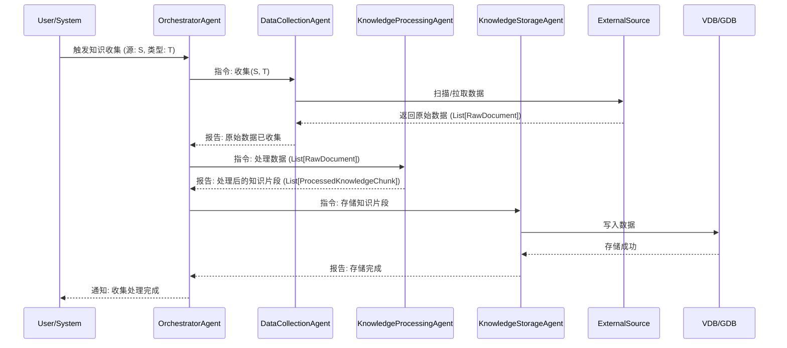
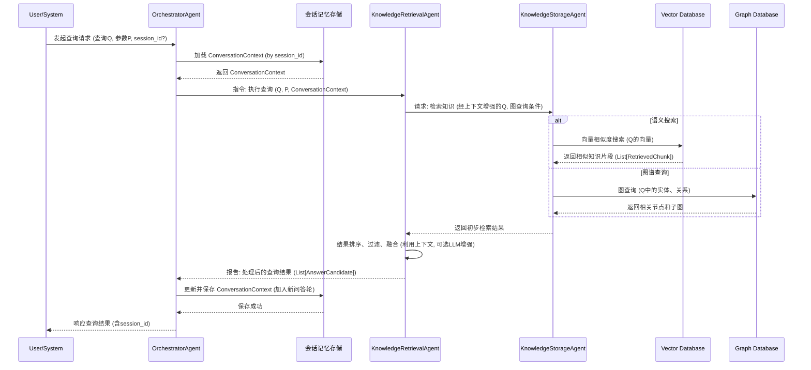

# 知识库多智能体系统技术文档

## 1. 引言

### 1.1 背景

本文档旨在详细阐述知识库多智能体系统的技术实现方案。该系统通过模块化的智能体协作，实现高效的知识管理，包括知识的收集、处理、存储、检索和维护。

### 1.2 目标

为开发团队提供清晰的技术指引，确保系统按照设计规范进行开发、部署和维护。

### 1.3 范围

本文档覆盖系统的架构设计、核心智能体功能、数据流、接口定义、关键数据结构以及未来技术演进方向。

## 2. 系统架构

### 2.1 整体架构

系统采用分层架构，自上而下分为表现层、编排与控制层、执行层以及数据与知识层。这种设计模式确保了各层职责分明、高度解耦，从而提升了系统的可扩展性、可维护性和灵活性。

### 2.2 架构图

```mermaid
graph TD
    A[用户]

    subgraph 表现层 (Presentation Layer)
        B[Web/Chat Interface: React/Vue, WebSocket]
    end

    subgraph 编排与控制层 (Orchestration Layer)
        C1[用户接口智能体 (UI Agent)]
        C2[主控/编排智能体 (Orchestrator)]
        C1 <--> C2
    end

    subgraph 执行层 (Execution Layer)
        D1[查询分析智能体 (Query Parser)] --> D2[任务分解智能体 (Task Decomposer)] --> D3[信息检索体 (Retrieval Agents)] --> D4[答案生成智能体 (Answer Generator)]
    end

    subgraph 数据与知识层 (Data Layer)
        E1[(Vector DB)]
        E2[(SQL DB)]
        E3[(Graph DB)]
        E4[(Internal APIs)]
    end

    A -- Request --> B
    B -- Response --> A

    B -- User Query --> C1
    C2 -- Formatted Answer --> B

    C1 -- Feedback --> D1
    C2 -- Sub-tasks --> D2
    D4 -- Synthesized Info --> C2

    D3 -- Data --> E1
    D3 -- Data --> E2
    D3 -- Data --> E3
    D3 -- Data --> E4
```

### 2.3 分层说明

#### 2.3.1 表现层 (Presentation Layer)
- **职责**: 作为系统的用户交互界面，负责接收用户的查询请求并以友好的格式展示最终答案。
- **组件**:
  - **Web/Chat Interface**: 基于 React/Vue 和 WebSocket 等前端技术构建，为用户提供实时、动态的交互体验。

#### 2.3.2 编排与控制层 (Orchestration Layer)
- **职责**: 系统的“大脑”，负责核心的协调与控制。它管理用户会话，解析用户意图，并将任务分派给执行层，最终将格式化的答案返回给表现层。
- **组件**:
  - **用户接口智能体 (UI Agent)**: 直接与表现层对接，管理用户交互逻辑，并将用户输入转化为内部指令。
  - **主控/编排智能体 (Orchestrator)**: 系统的总指挥，负责任务的整体规划、智能体之间的协作以及最终结果的合成。它对应于本文档后续章节中详细描述的 `OrchestratorAgent`。

#### 2.3.3 执行层 (Execution Layer)
- **职责**: 负责执行具体的子任务。它将来自编排层的复杂任务分解、执行，并从数据层获取所需信息。
- **组件**:
  - **查询分析智能体 (Query Parser)**: 对用户查询进行深入分析，提取关键意图和实体。
  - **任务分解智能体 (Task Decomposer)**: 将复杂的查询分解为一系列可执行的、更小的子任务。
  - **信息检索体 (Retrieval Agents)**: 根据子任务，从数据与知识层的不同数据源中检索信息。这对应于 `KnowledgeRetrievalAgent` 的核心功能。
  - **答案生成智能体 (Answer Generator)**: 综合检索到的信息，生成连贯、准确的答案，并将合成后的信息（Synthesized Info）返回给编排层。

#### 2.3.4 数据与知识层 (Data Layer)
- **职责**: 为系统提供所有必需的数据和知识。
- **组件**:
  - **向量数据 (Vector DB)**: 存储文本、图像等内容的向量表示，用于高效的语义相似度搜索。
  - **关系型数据 (SQL DB)**: 存储结构化数据。
  - **知识图谱数据库 (Graph DB)**: 存储实体及其相互关系，用于复杂的关联查询和推理。
  - **内部 API 服务 (Internal APIs)**: 提供对组织内部其他系统或服务的访问接口。

### 2.4 智能体映射关系

本文档中描述的 `DataCollectionAgent`, `KnowledgeProcessingAgent`, 和 `KnowledgeStorageAgent` 主要服务于**数据与知识层**的构建和维护。`KnowledgeRetrievalAgent` 的功能分布在**执行层**的 `Query Parser` 和 `Retrieval Agents` 中。`KnowledgeMaintenanceAgent` 负责确保**数据与知识层**的持续更新与准确性。而 `OrchestratorAgent` 则是**编排与控制层**的核心。

## 3. 智能体详细设计

### 3.1 协调智能体 (OrchestratorAgent)

- **职责**：
  - 接收用户请求或系统事件，包含可选的 `session_id`。
  - 管理会话上下文 (`ConversationContext`)：根据 `session_id` 加载、更新和保存会话历史及相关记忆。**负责决策记忆的写入，包括处理记忆重复（例如，决定是覆盖、合并还是作为新记忆存储，可能涉及调用 LLM 进行压缩合并）和记忆溢出（例如，根据 FIFO、重要性评分或用户指令选择淘汰策略）。**
  - 解析请求，结合会话上下文，确定所需执行的任务和涉及的专业智能体。
  - 将任务（包含必要的会话上下文）分发给相应的专业智能体。
  - 监控任务执行状态。
  - 汇总各智能体的处理结果，并更新会话上下文（例如，将新的问答对加入历史）。
  - 管理智能体之间的通信和工作流程。
  - 向用户或外部系统返回最终结果和 `session_id`。
- **输入**：用户请求（查询、知识更新指令等，可包含 `session_id`）、系统事件。
- **输出**：任务指令（包含 `ConversationContext`）给其他智能体、最终结果（包含 `session_id`）给用户/外部系统。
- **核心逻辑**：基于预定义的工作流或动态规划能力进行任务调度和流程控制，并集成会话管理逻辑。
- **交互组件**: 会话记忆存储 (用于读写 `ConversationContext`)。

### 3.2 数据收集智能体 (DataCollectionAgent)

- **职责**：
  - 根据指令从指定数据源（如文档库、代码仓库、Git、外部 API）收集原始知识数据。
  - 支持不同数据源的适配和数据获取。
- **输入**：收集指令（包含数据源配置、收集范围等）。
- **输出**：原始数据（RawDocument 列表）。
- **子模块/工具**：可包含针对不同数据源的收集器插件（如 DocCollector, CodeCollector, GitCollector, ApiCollector）。

### 3.3 知识处理智能体 (KnowledgeProcessingAgent)

- **职责**：
  - 对收集到的原始数据进行清洗、格式转换。
  - 进行文本预处理（分词、去停用词等）。
  - 生成文本向量（Embedding）。
  - 进行知识分类、实体识别、关系抽取。
  - 将原始数据转换为结构化或半结构化的知识片段。
- **输入**：原始数据（RawDocument 列表）。
- **输出**：处理后的知识片段（ProcessedKnowledgeChunk 列表）。
- **依赖**：可能需要调用外部 LLM 服务进行高级 NLP 处理。

### 3.4 知识存储智能体 (KnowledgeStorageAgent)

- **职责**：
  - 将处理后的知识片段持久化存储。
  - 管理向量数据及其索引（存储到向量数据库）。
  - 管理实体和关系数据（存储到图数据库）。
  - 维护知识版本和元数据。
  - 管理缓存数据。
- **输入**：处理后的知识片段（ProcessedKnowledgeChunk 列表）、缓存管理指令。
- **输出**：存储操作的成功/失败状态。
- **交互组件**：Vector Database, Graph Database, Cache。

### 3.5 知识检索智能体 (KnowledgeRetrievalAgent)

- **职责**：
  - 根据用户查询请求和传入的 `ConversationContext` 执行知识检索。
  - **记忆读取与利用**：
    - **实现记忆评分函数**：根据公式 \(S*{total} = w_n S*{newness} + w*r S*{relevance} + w*i S*{importance}\) 计算每个记忆片段的综合得分。
      - \(S\_{newness}\): 基于记忆的创建时间或最近访问时间，时间越近得分越高。
      - \(S\_{relevance}\): 利用如 LSH, ANNOY, HNSW, FAISS 等方法计算用户查询与记忆内容之间的语义相似度。
      - \(S\_{importance}\): 记忆自身特征的评分，与查询无关，可能基于记忆被访问的频率、用户指定的关键程度或反思过程中赋予的权重。
    - **参数调整**：\(w_n, w_r, w_i\) 为可配置的平衡参数，允许根据不同场景调整记忆读取策略。
    - **提取高价值记忆**：选择综合得分最高的记忆片段，用于增强查询理解或直接作为部分答案。
  - **利用会话历史进行查询增强**：
    - 指代消解：识别查询中的代词（如"它"，"他们"）指向对话历史中的哪个实体。
    - 上下文补充：如果当前查询不完整，从历史中提取相关信息补充查询。
    - 意图理解：基于历史对话更准确地判断用户当前查询的意图。
  - 将（可能已增强的）查询语句转换为向量或图查询语句。
  - 从向量数据库执行语义相似度搜索。
  - 从图数据库执行关联查询。
  - 对检索结果进行排序、过滤和融合。
  - (可选) 利用 LLM 对检索结果进行增强或生成摘要，此时 LLM 也应接收到相关的会话上下文。
- **输入**：用户查询（文本）、`ConversationContext` 对象、检索参数（如 top_k, filters）。
- **输出**：查询结果（AnswerCandidate 列表）。
- **交互组件**：KnowledgeStorageAgent (间接访问 VDB, GDB)。

### 3.6 知识维护智能体 (KnowledgeMaintenanceAgent)

- **职责**：
  - 监控知识源的变更。
  - 执行知识的自动更新流程。
  - 检测知识冲突并尝试解决或上报。
  - 验证知识的有效性和一致性。
- **输入**：知识源配置、变更事件、验证指令。
- **输出**：变更事件列表（ChangeEvent）、验证结果（ValidationResult）、冲突解决报告（Resolution）。
- **交互组件**：KnowledgeStorageAgent (用于读写和验证知识)。

## 4. 数据模型与接口定义

### 4.1 主要数据结构

#### 4.1.1 RawDocument

```json
{
  "id": "str (唯一标识)",
  "content": "any (原始数据内容，如文本、代码片段、API响应)",
  "source": "str (数据来源标识，如文件路径、URL)",
  "type": "str (数据类型，如'document', 'code', 'git_commit')",
  "metadata": "dict (其他元数据，如创建时间、作者)"
}
```

#### 4.1.2 ProcessedKnowledgeChunk

```json
{
  "id": "str (唯一标识)",
  "original_id": "str (关联的 RawDocument ID)",
  "text_content": "str (处理后的文本内容，用于向量化和检索)",
  "vector": "List[float] (文本内容的向量表示)",
  "category": "str (知识分类)",
  "entities": "List[str] (识别出的实体)",
  "relationships": "List[dict] (抽取的实体间关系，如 {'source_entity': 'A', 'target_entity': 'B', 'relation': 'related_to'})",
  "metadata": "dict (其他元数据，如处理时间、版本)"
}
```

#### 4.1.3 RetrievedChunk

```json
{
  "id": "str (知识片段ID)",
  "text_content": "str (知识文本内容)",
  "score": "float (检索相关性得分)",
  "metadata": "dict (元数据)"
}
```

#### 4.1.4 AnswerCandidate

```json
{
  "content": "str (最终呈现给用户的答案内容)",
  "source_id": "str (答案来源的知识片段ID)",
  "relevance_score": "float (答案相关性得分)",
  "context_snippets": "List[str] (相关的上下文片段)"
}
```

#### 4.1.5 ChangeEvent (用于知识维护)

```json
{
  "event_id": "str",
  "source_config": "dict (发生变更的知识源配置)",
  "change_type": "str ('created', 'updated', 'deleted')",
  "changed_item_id": "str (变更内容的标识)",
  "timestamp": "datetime"
}
```

#### 4.1.6 ValidationResult (用于知识维护)

```json
{
  "knowledge_id": "str",
  "is_valid": "bool",
  "validation_details": "dict (验证详情，如错误信息)"
}
```

#### 4.1.7 Resolution (用于知识维护)

```json
{
  "conflict_id": "str",
  "resolved_status": "bool",
  "resolution_strategy": "str (解决策略)",
  "details": "str (解决详情)"
}
```

#### 4.1.8 ConversationContext (New)

```json
{
  "session_id": "str (会话的唯一标识)",
  "user_id": "str (可选, 用户的唯一标识)",
  "history": [
    {
      "role": "str ('user' 或 'assistant')",
      "content": "str (该轮对话的文本内容)",
      "timestamp": "datetime"
    }
  ],
  "short_term_memory": [
    // 用于存储最近的、高频访问的或与当前任务直接相关的记忆
    {
      "memory_id": "str",
      "content": "any",
      "type": "str (e.g., 'action_result', 'observation', 'retrieved_knowledge')",
      "creation_time": "datetime",
      "last_access_time": "datetime",
      "relevance_score_to_current_query": "float (可选, 动态计算)",
      "importance_score": "float (可选, 可由反思机制更新)",
      "metadata": "dict"
    }
  ],
  "long_term_memory_references": [
    // 指向更持久记忆存储中的相关记忆ID
    "str (memory_id_in_KSA_or_dedicated_memory_db)"
  ],
  "current_task": "str (可选, 当前会话的主要任务或意图)",
  "agent_state": "dict (可选, OrchestratorAgent或其他agent的内部状态)"
}
```

#### 4.1.9 AgentActionLog (用于记忆和反思)

```json
{
  "action_id": "str (唯一行动标识)",
  "session_id": "str (关联的会话)",
  "agent_name": "str (执行动作的智能体)",
  "timestamp": "datetime",
  "goal": "str (该行动的目标)",
  "action_details": "dict (具体行动参数和内容)",
  "outcome": {
    "status": "str ('success', 'failure', 'pending')",
    "result": "any (行动结果)",
    "error_message": "str (如果失败)"
  },
  "raw_observations": "List[str] (行动相关的原始观察)",
  "reflection_insights": "List[str] (从此行动反思得出的见解)"
}
```

### 4.2 智能体接口定义 (Python 风格)

#### 4.2.1 OrchestratorAgent

```python
class ConversationContext(Dict[str, Any]): # 实际可用 Pydantic BaseModel
    session_id: str
    user_id: Optional[str]
    history: List[Dict[str, Any]]
    user_preferences: Optional[Dict[str, Any]]
    scratchpad: Optional[Dict[str, Any]]

class OrchestratorAgent:
    def receive_request(self, source: str, request_type: str, payload: dict, session_id: Optional[str] = None) -> dict: # 返回执行结果或任务ID
        """接收外部请求或系统事件，处理会话上下文"""
        # 1. 根据 session_id 加载或创建 ConversationContext
        # 2. 更新 payload，可能将 ConversationContext 加入其中或其部分内容加入
        # 3. ...分发任务...
        # 4. 聚合结果后，更新 ConversationContext 并保存
        # 5. 返回结果时，确保包含 session_id
        pass

    # distribute_task 和 aggregate_result 可能也需要感知 ConversationContext
    def distribute_task(self, agent_name: str, task_name: str, task_params: dict, conversation_context: Optional[ConversationContext] = None) -> str: # 返回任务ID
        """分发任务给特定智能体，可选择性传递会话上下文"""
        pass

    def aggregate_result(self, source_agent: str, task_id: str, status: str, result: dict, conversation_context: Optional[ConversationContext] = None) -> None:
        """接收智能体处理结果并进行汇总，可用于更新会话上下文"""
        pass
```

#### 4.2.2 DataCollectionAgent

```python
from typing import List, Dict, Any

class RawDocument(Dict[str, Any]): # 实际可用 Pydantic BaseModel
    id: str
    content: Any
    source: str
    type: str
    metadata: Dict[str, Any]

class DataCollectionAgent:
    def collect(self, source_config: dict) -> List[RawDocument]:
        """执行数据收集"""
        pass
```

#### 4.2.3 KnowledgeProcessingAgent

```python
from typing import List, Dict, Any

class ProcessedKnowledgeChunk(Dict[str, Any]): # 实际可用 Pydantic BaseModel
    id: str
    original_id: str
    text_content: str
    vector: List[float]
    category: str
    entities: List[str]
    relationships: List[dict]
    metadata: Dict[str, Any]

class KnowledgeProcessingAgent:
    def process(self, documents: List[RawDocument]) -> List[ProcessedKnowledgeChunk]:
        """处理原始文档"""
        pass
```

#### 4.2.4 KnowledgeStorageAgent

```python
from typing import List, Dict, Any

class RetrievedChunk(Dict[str, Any]): # 实际可用 Pydantic BaseModel
    id: str
    text_content: str
    score: float
    metadata: Dict[str, Any]

class KnowledgeStorageAgent:
    def store(self, chunks: List[ProcessedKnowledgeChunk]) -> bool:
        """存储处理后的知识"""
        pass

    def retrieve(self, query_vector: List[float], top_k: int, filters: dict) -> List[RetrievedChunk]:
        """向量检索"""
        pass

    def graph_query(self, cypher_query: str) -> List[dict]:
        """图数据库查询"""
        pass
```

#### 4.2.5 KnowledgeRetrievalAgent

```python
from typing import List, Dict, Any, Optional

class AnswerCandidate(Dict[str, Any]): # 实际可用 Pydantic BaseModel
    content: str
    source_id: str
    relevance_score: float
    context_snippets: List[str]

class KnowledgeRetrievalAgent:
    def search(self, query: str, search_params: dict, conversation_context: Optional[ConversationContext] = None) -> List[AnswerCandidate]:
        """执行知识检索，利用会话上下文增强查询理解"""
        # 1. 使用 conversation_context.history 进行指代消解、查询扩展等
        # 2. ...后续检索逻辑...
        pass
```

#### 4.2.6 KnowledgeMaintenanceAgent

```python
from typing import List, Dict, Any

# ChangeEvent, ValidationResult, Resolution 结构可定义为 Pydantic BaseModel
class ChangeEvent(Dict[str, Any]): pass
class ValidationResult(Dict[str, Any]): pass
class Resolution(Dict[str, Any]): pass


class KnowledgeMaintenanceAgent:
    def check_updates(self, source_config: dict) -> List[ChangeEvent]:
        """检查知识源变更"""
        pass

    def validate_knowledge(self, knowledge_id: str) -> ValidationResult:
        """验证知识有效性"""
        pass

    def resolve_conflict(self, conflict_info: dict) -> Resolution:
        """解决知识冲突"""
        pass
```

**注意**: 上述接口为初步定义，具体实现时可能采用消息队列（如 RabbitMQ, Kafka）、RPC (如 gRPC) 或基于 HTTP 的 RESTful API 等通信机制。数据结构建议使用 Pydantic 等工具进行强类型定义和校验。

## 5. 核心工作流程

### 5.1 知识收集与处理流程



### 5.2 知识检索流程



## 6. 技术选型思考 (基于项目规范和设计文档推断)

### 5.1 核心技术选型

- **编程语言**：Python
- **核心框架**：LangChain (用于 Agent 构建、工具集成、链式调用), FastAPI (用于 HTTP 服务)
- **向量数据库**：FAISS, Milvus, Qdrant 或 ChromaDB (根据实际需求选择，需支持高效的 \(S\_{relevance}\) 计算)
- **图数据库**：Neo4j 或 ArangoDB (可选，用于复杂知识关系管理)
- **缓存**：Redis (用于存储 `ConversationContext` 和其他需要快速访问的数据)
- **LLM 服务**：可配置接入 OpenAI GPT 系列、Claude 或其他本地部署模型 (用于记忆合并、反思生成见解等)
- **依赖管理**：Poetry 或 UV

### 5.2 关键技术点

- **高效的会话管理与上下文传递**：确保 `ConversationContext` 在各智能体间有效传递和更新。
- **灵活的记忆评分与读取策略**：实现可配置的记忆读取机制，支持不同场景下的优化。
- **智能的记忆写入与溢出管理**：设计处理记忆重复和容量限制的有效策略。
- **深度的记忆反思与知识抽象**：开发能够从历史记忆中学习和提炼高阶知识的模块。

## 7. 未来技术演进方向

### 7.1 更智能的协调 (OrchestratorAgent)

- **技术点**:
  - 引入规划算法（如 PDDL-like planners）或基于强化学习的决策模型。
  - 实现动态工作流调整和智能体组合。
  - 利用历史性能数据优化路由策略。

### 7.2 智能体能力增强

- **DataCollectionAgent**:
  - 支持流式数据处理 (Kafka, Flink)。
  - 集成 OCR 工具处理图像中的文本。
  - 支持实时音视频转录服务。
- **KnowledgeProcessingAgent**:
  - 集成更先进的 NLP 模型 (如最新的 Transformer 架构)。
  - 采用多任务学习模型进行联合实体识别、关系抽取、事件抽取。
  - 引入知识图谱嵌入技术 (KGE) 辅助关系推理。
- **KnowledgeRetrievalAgent**:
  - 实现多模态检索 (CLIP-based models for image-text)。
  - 增强对话管理能力，支持多轮问答和上下文保持 (e.g., using memory components from LangChain, and the `ConversationContext` described here)。
- **KnowledgeMaintenanceAgent**:
  - 利用异常检测算法识别过时或冲突知识。
  - 探索基于知识图谱推理的知识缺口预测。

### 7.3 人机协同与交互

- **技术点**:
  - 开发基于 Web 的管理界面 (React, Vue, or FastAPI with Jinja templates)。
  - 设计清晰的 API 供外部系统或人工审核工具调用。
  - 实现标注平台接口，方便专家反馈。

### 7.4 系统可扩展性与鲁棒性

- **技术点**:
  - 将各智能体设计为可独立部署和伸缩的微服务 (Docker, Kubernetes)。
  - 优化数据库连接池和查询性能。
  - 实现更完善的分布式追踪 (OpenTelemetry) 和日志聚合 (ELK Stack)。
  - 引入断路器、重试机制、幂等性设计。

### 7.5 安全性与权限控制

- **技术点**:
  - OAuth 2.0 / OIDC 进行认证授权。
  - 实现基于角色的访问控制 (RBAC) 和属性基访问控制 (ABAC)。
  - 对敏感数据进行加密存储和传输 (TLS/SSL)。
  - 定期进行安全审计和漏洞扫描。

### 7.6 高级记忆管理与反思的深化

- **记忆读取优化**:
  - **动态权重调整**：研究基于当前任务类型、对话阶段或用户反馈动态调整 \(w_n, w_r, w_i\) 参数的策略。
  - **上下文感知的重要性评估**：使 \(S\_{importance}\) 的评估不仅仅基于记忆自身特征，还能结合当前对话上下文动态调整。
- **记忆写入策略**:
  - **LLM 驱动的记忆合并**：当检测到与现有记忆高度相似的新信息（记忆重复）时，利用 LLM 将新旧信息智能合并，形成更全面或更新的记忆条目，而非简单覆盖或独立存储。例如，将多个相似的成功行动序列（`AgentActionLog`）压缩为统一的计划或经验总结。
  - **基于价值的记忆溢出**：在记忆达到存储上限时，除了 FIFO，优先淘汰重要性评分低、访问频率低或与近期任务关联度低的记忆。允许用户通过指令显式删除特定记忆。
- **记忆反思机制的实现**:
  - **分层与多样化反思**：
    - **问题驱动反思 (Generative Agents 模式)**：`OrchestratorAgent` 或专门的 `ReflectionAgent` 定期或在关键事件后（如任务完成/失败），根据最近的 `ConversationContext` 和 `AgentActionLog` 生成关键问题。这些问题随后用于查询 `KnowledgeStorageAgent` (包括历史记忆)，并基于检索到的信息和 LLM 生成高层见解或摘要，存储回记忆或更新 `ProcessedKnowledgeChunk`。
    - **模式总结 (GITM 模式)**：当 `OrchestratorAgent` 监测到一系列与同一（子）目标相关的成功 `AgentActionLog` 达到一定数量时，触发反思，使用 LLM 将这些行动序列总结为通用的、抽象的模式或策略，并存储为新的高级记忆。
    - **对比学习反思 (ExpeL 模式)**：在任务结束后，比较成功和失败的 `AgentActionLog` 轨迹，识别导致不同结果的关键决策点或环境因素，提炼经验教训。
  - **反思结果的整合**：研究如何将反思产生的抽象知识（如新策略、重要见解）有效地组织并整合回 `KnowledgeStorageAgent` 或 `ConversationContext` 的记忆结构中，以便未来被高效检索和利用。例如，更新相关记忆的 `importance_score` 或创建新的高级知识条目。
- **记忆结构与组织**:
  - **多模态记忆**：探索存储和检索非文本记忆（如图像、音频片段的摘要或表征）。
  - **情景记忆与语义记忆的分离与关联**：设计更精细的记忆库，区分具体的事件经历（情景记忆，如 `AgentActionLog`）和抽象的知识概念（语义记忆，如 `ProcessedKnowledgeChunk`），并建立它们之间的链接。

### 7.7 系统性能与可扩展性

- **技术点**:
  - 将各智能体设计为可独立部署和伸缩的微服务 (Docker, Kubernetes)。
  - 优化数据库连接池和查询性能。
  - 实现更完善的分布式追踪 (OpenTelemetry) 和日志聚合 (ELK Stack)。
  - 引入断路器、重试机制、幂等性设计。

---
